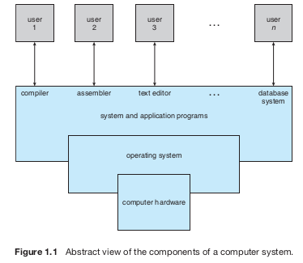

## Plano de Ensino

Haverá três avaliações:

- Prova 1: 25/11 (sexta-feira)
- Prova 2: 23/12 (sexta-feira)
- Prova 3: 03/02 (sexta-feira)
- Prova substitutiva: 06/02 (segunda-feira)

Média final:

$ MP = 0,1 \cdot P1 + 0,3 \cdot P2 + 0,6 \cdot P3 $ 
$ MF = 0,6 \cdot MP + 0,4 \cdot MT $

Na média ponderada dos trabalhos (MT), no juiz online (CD-MOJ), o trabalho $T_n$ terá peso $n$.

> Critério de aprovação:
>
> $ MF \geq 5 \wedge MP \geq 5 \wedge frequência \geq 75\% $.

## Aula 1 - Introdução aos Sistemas Operações

### Linux

- O linux é apenas o **kernel**, em torno do qual orbitam as distribuições.
- É um sistema velox e possui comunidade ampla e atuante.
- Segurança satisfatória.

### MINIX

- SO criado pelo Tanenbaum com fins didáticos.
- O Linux foi desenvolvido com base no MINIX. A primeira compilação do Linux foi em um MINIX do Linus Torvalds.
- Poucas opções de plataformas: x86 e arm.

### FreeBSD

- Não é apenas um kernel, mas um sistema completo.
- UNIX.
- Derivado do Linux.
- Poucas opções de plataformas: x86, amd64 e arm.

### OpenBSD

- Foco em segurança em corretude.
- Red Team Field Manual.
- Provedor de ferramentas importantes para o mundo *nix: OpenSSH, OpenNTPD, OpenSMPD, realyd, spamd, httpd, tmux etc.
- Suporte a ampla gama de arquiteturas.

### NetBSD

- Amplo suporte a hardware.
- Propôs gerenciador de pacotes (pckgsrc) que serviu de inspiração aos gerenciadores de pacotes dos outros BSDs e Linux.
- Uso de linguagens não usuais no kernel (LUA).

## Capítulo 1 - Silberschatz

### O que é um sistema operacional?

Um sistema operacional é um programa que gerencia o *hardware* de um computador. É um intermediário entre o usuário de um computador e o hardware deste.

Os principais objetivos de um sistema operacional são:

- Executar programas do usuário e facilitar a resolução de problemas do usuário.
- Tornar o uso de um sistema computacional conveniente para o usuário.
- Usar o *hardware* de um computador de maneira eficiente.

Como um sistema operacional é extenso e complexo, ele deve ser criado parte por parte. Cada uma dessas partes deve ser uma porção bem delimitada do sistema, com entradas, saídas e funções cuidadosamente definidas.

### Estrutura de um sistema computacional

Um sistema computacional pode ser dividido em quatro componentes:

- Hardware: provê recursos computacionais básicos.
  - CPU, memória, dispositivos I/O.
- Sistema Operacional
  - Controla e coordena o uso do hardware por diversas aplicações e usuários.
- Aplicações: define a forma como recursos computacionais são usados para resolver problemas computacionais do usuário.
  - Editores de texto, compiladores, navegadores de internet, sistemas de banco de dados, jogos.
- Usuários
  - Pessoas, máquinas ou outros computadores.

### Quatro componentes de um sistema computacional

### O que sistemas operacionais fazem

-

## Definição de um sistema operacional

Um sistema operacional é um alocador de recursos.

- Gerencia todos os recursos.
- Efetua as decisões de acesso a recursos;

Um sistema operacional é um programa de controle.

- Controla a execução dos programas para prevenir erros e uso impróprio do computador.

## Computer Startup 

## Computer System Organization

## Computer-System Operation
