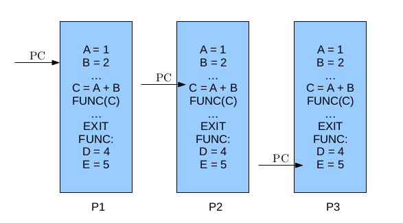
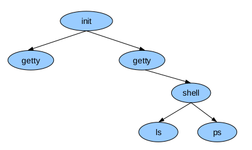
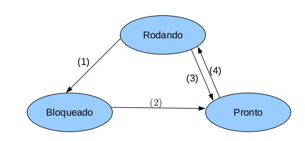
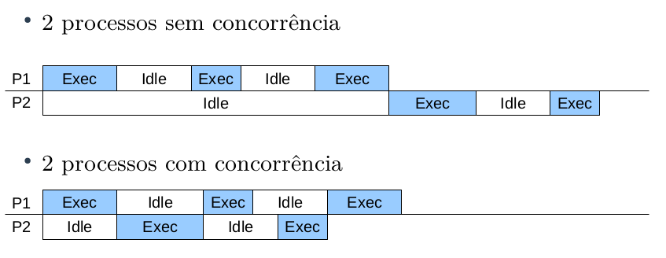

# Processos

Um processo é um programa em execução acompanhado de valores de tempo de execução. É composto por:

- Código executável
- Pilha de execução contendo valores de variáveis locais
- Apontador para a pilha, um registrador da CPU que armazena em qual área de memória está a pilha
- Contador de programa, um registrador da CPU que armazena a próxima instrução a ser executada
- Valores dos registradores gerais da máquina

> Note a diferença entre programas e processos: um processo envolve uma atividade, enquanto programas envolvem algoritmos, mas não a sua execução.

Para um processo, são relevantes informações sobre o **ambiente**, como espaço de endereçamento, arquivos abertos, processos filhos, sinais e estatísticas de uso, e sobre a **execução**, como o contador de programa, apontador de pilha, conjunto de registradores e estado de execução.

Os processos podem ser classificados em relação ao custo da troca de contexto e manutenção em **heavyweight** (processo tradicional) ou **lightweight** (threads). O processo **heavyweight** é composto tanto pelo ambiente quanto pela execução. Cada processo possui um único fluxo de controle, contador de programa, e roda de forma independente dos demais. Em um dado momento há vários processos ativos e o processador é chaveado entre eles.

## Ciclo de Vida dos Processos

### Criação

Processos podem ser criados:

- No início do sistema;
- Ao executar uma chamada ao sistema de criação de processo por um processo em execução;
- Por requisição do usuário;
- Início de um job de lote.

Ao iniciar o sistema operacional, diversos processos são criados, alguns executando em primeiro plano e interagindo com o usuário, outros em segundo plano, chamados de **daemons**. Normalmente os processos são criados por outro.

No Unix há apenas uma forma de se criar processos, por meio da clonagem (`fork()`). Esse comando cria um clone idêntico ao processo que o chamou, e normalmente é executado `execve` depois da chamada para mudar o "programa" em execução. No Windows há uma função que trata o processo de criação e carga do programa, o `CreateProcess`.

### Término

Processos podem terminar de forma voluntária ou involuntária, com as seguintes condições de término:

- Saída normal (voluntária);
- Saída por erro (voluntária);
- Erro fatal (involuntário);
- Cancelamento por outro processo (involuntário);

### Hierarquia

Quando um processo é criado por outro, eles continuam associados, e em alguns sistemas é possível listar o `ppid` (parent pid) de um processo.

No Unix todos os processos são filhos do `init` (ou `systemd`). O Windows não apresenta hierarquia de processos.

### Estados

Quando um processo está esperando um evento, como leitura em disco, leitura de rede ou entrada do usuário, dizemos que o processo está **bloqueado**. Um processo pode estar:

- Rodando
- Bloqueado
- Pronto

> Sistemas **monoprocessados** são aqueles que possuem apenas um processo rodando.

Um processo circula entre os estados conforme ilustrado, de forma que quando o processo aguarda um evento ele se bloqueia (1), quando o evento esperado ocorre, o processo torna-se pronto (2), então pode ser escolhido pelo escalonador para executar (4) e retorna para o estado de pronto quando seu tempo de posse do processador se esgota (3).

## Classificação

### Processos CPU Bound e I/O Bound

Processos podem ser classificados como CPU ou I/O bound:

- CPU Bound (afinidade à CPU): passam a maior parte do tempo usando a CPU, no estado rodando ou pronto.
- I/O Bound (afinidade à Entrada e Saída): passam a maior parte do tempo em estado bloqueado por causarem muitas operações de entrada e saída.

## Implementação

Todas as informações sobre um processo são mantidas na **tabela de processos** (ou **bloco de controle de processo**), que pode ser acessada pelo comando `ps aux`. Os campos dizem respeito à gerência do processo, da memória e dos arquivos. Cada processo possui um identificador único `pid` (process id).

Na tabela de processos, constam as seguintes informações:

<table>
<tr>

<th> Gerenciamento de processos</th>
<th> Gerenciamento de memória</th>
<th> Gerenciamento de arquivos</th>

<tr><td> Registradores                 </td><td rowspan=5> Ponteiro para o segmento de dados </td><td rowspan=3>Diretório-raiz                </td></tr>
<tr><td> Contador de programa          </td></tr>
<tr><td> Palava de estado do programa  </td></tr>
<tr><td> Ponteiro de pilha             </td><td rowspan=3>Diretório de trabalho          </td></tr>
<tr><td> Estado do processo            </td></td>
<tr><td> Prioridade                    </td><td rowspan=5> Ponteiro para o segmento de pilha </td></tr>
<tr><td> Parâmetros de escalonamento   </td><td rowspan=3>Descritores de arquivos            </td></tr>
<tr><td> Identificador do processo(PID)</td></tr>
<tr><td> Processo pai (PPID)           </td></tr>
<tr><td> Grupo do processo             </td><td rowspan=3>Identificador do usuário           </td></tr>
<tr><td> Sinais                        </td>             </td>  </tr>
<tr><td> Momento em que iniciou        </td><td rowspan=4> Ponteiro para o segmento de código</td></tr>
<tr><td> Tempo de uso de CPU           </td><td rowspan=3>Identificador do grupo              </td></tr>
<tr><td> Tempo de CPU do filho         </td></tr>
<tr><td> Momento do próximo alarme     </td></tr>
</table>

> A **troca de contexto** é a operação de salvar os registradores de um processo e restauração dos registradores de outro. A troca de contexto permite a troca do processador entre os processos e é a operação básica da **multiprogramação**.

Para manter a ilusão de múltiplos processos rodando sequencialmente em uma máquina com uma CPU e vários dispositivos de E/S, esses dispositivos possuem uma área da memória chamada **vetor de interrupções**, que contém os endereços de procedimentos dos serviços de interrupção.

## Escalonamento de Processos

O Sistema Operacional é responsável por gerenciar os recursos de processamento de um computador, e essa atividade é conhecida como **escalonamento de processador**. Já a interação entre processos é realizada por meio de mecanismos de comunicação.

Quando múltiplos processos encontram-se no estado **pronto**, o **escalonador** do sistema operacional elege um para execução, utilizando um **algoritmo de escalonamento**. Este algoritmo é responsável por determinar qual processo irá rodar, e por quanto tempo poderá utilizar o processador.

> Quando um processo solicita operações blocantes (E/S), sua execução fica suspensa até que o evento ocorra.

A execução concorrente provém uma melhor utilização da CPU, especialmente para processos I/O Bound.

Os escalonadores podem ser classificados em *preemptivos** e **não-preemptivos**, sendo que a preempção é a suspensão temporária da execução de um processo.

### Classificação de Escalonadores

#### Escalonadores Não-Preemptivos

Os escalonadores **não-preemptivos** permitem que um processo rode até o fim, ou até que ele mesmo se bloqueie, após a obtenção do processador. Nessa situação, nenhuma entidade externa pode "tirar a CPU à força" do processo. Esses escalonadores são fáceis de implementar, mas, em contrapartida, permitem o abuso no tempo de CPU de um determinado programa, o que viola os critérios de um bom escalonador.

#### Escalonadores Preemptivos

Nesse modelo de escalonamento, cada processo possui um tempo (*time-slice*) de posse do processador, e quando o tempo se esgota o SO retira o processador desse processo e permite que outro processo execute. Esse controle de tempo de execução é feito por interrupções.

Os processadores modernos possuem um *clock* que gera as interrupções a uma frequência determinada, e o SO mantém um contador (indicando o tempo máximo de permanência do processo com a CPU) que é decrementado a cada *clock tick*, se o contador chegar a zero, o tempo de permanência do processo terá se esgotado.

Esses escalonadores asseguram um uso mais balanceado da CPU e são utilizados na maioria dos SO modernos, mas geram complicações na programação de processos concorrentes.

### Critérios de Escalonamento

Um bom escalonador deve estar atento aos critérios a seguir, embora seja impossível atingir todos:

- **Justiça**: todos os processos devem ter chances justas de uso do processador (não são chances iguais);
- **Eficiência**: o processador deve estar ocupado sempre que houver trabalho a fazer;
- **Minimizar o tempo de resposta**: reduzir o tempo entre a entrada de usuário e a resposta dada;
- **Minimizar o turnaround**: reduzir o tempo desde o lançamento do processo até seu término (soma de tempo de espera por recursos e tempo de utilização da CPU);
- **Minimizar o waiting time**: minimizar o tempo de espera pela CPU;
- **Maximizar o throughput**: maximizar o número de tarefas em uma unidade de tempo;

### Algoritmos de Escalonamento

Algoritmos de Escalonamento visam dividir a utilização do processo entre processos que devem ser executados. Alguns dos algoritmos clássicos são: [First Come First Served](#first-come-first-served), [Round-Robin](#round-robin), [Prioridades](#prioridades) e [Shortest Job First](#shortest-job-first).

#### First Come First Served

#### Round-Robin

#### Prioridades

#### Shortest Job First

## Referências

[1] TANENBAUM, A. S. Sistemas. Operacionais Modernos. 4ª ed. Prentice Hall, 2016.
