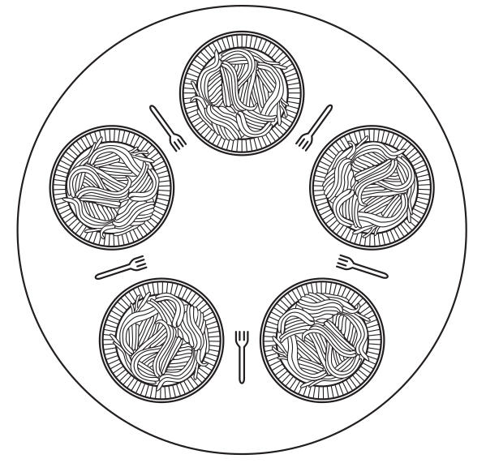

# Módulo 5 - Problemas Clássicos de IPC e Deadlock

## Relembrando

Processos podem se comunicar utilizando mecanismos de IPC (Inter-process Communication), como memória compartilhada ou comunicação por mensagens. A proteção que deve ser fornecida à essa comunicação pode gerar alguns problemas, como por exemplo **deadlock**, que ocorre quando dois ou mais processos aguardam mutuamente por um recurso utilizado por um deles, e **starvation**, que ocorre quando os mecanismos de sincronização não permitem que o programa avance. Para exemplificar o problema do _deadlock_ a literatura fornece alguns problemas clássicos, como o do [Jantar dos Filósofos](#problema-do-jantar-dos-filósofos).

## Problema do Jantar dos Filósofos

Esse problema foi formulado e resolvido por Dijkstra em 1965 e consiste na seguinte situação:

Cinco filósofos estão sentados em torno de uma mesa circular, cada qual com um prato de espaguete escorregadio, que para ser consumido necessita de dois garfos, mas não há garfos suficientes para que todos os filósofos comam ao mesmo tempo, já que há um garfo entre cada par de pratos (Figura 1).

<center>



Figura 1. Ilustração do problema do jantar dos filósofos. (Fonte: [1]).
</center>

Portanto, cada filósofo compartilha seus garfos com os filósofos imediatamente à esquerda e à direita. A vida de um filósofo consiste em alternar períodos de pensar e se alimentar, sendo que depois de pensar durante muito tempo ele tentará se alimentar.

Para se alimentar, o filósofo tenta pegar um garfo à sua esquerda e à sua direita, em qualquer ordem. Quando conseguir pegar os dois garfos, ele se alimentará, e em seguida devolverá os garfos à mesa.

```c title="filosofos.c" linenums="1"
--8<--
mod5/filosofos.c:solucao1
--8<--
```

O problema acontece se todos os filósofos tentarem pegar o garfo ao mesmo tempo, a depender do escalonamento. Se o escalonamento fizer a troca de contexto após a obtenção do primeiro garfo, quando o N-ésimo filósofo tentar pegar o garfo direito, este já terá sido obtido pelo filósofo à sua direita.Então, todos os filósofos ficarão bloqueados tentando obter o outro garfo, e esse problema é conhecido como **deadlock** (ou impasse).

**E se o filósofo devolver o garfo esquerdo se não conseguir obter o direito?**

Essa solução pode minimizar o problema, mas ainda é possível obter um escalonamento problemático, como no caso em que a troca de contexto ocorre após um filósofo obter ou liberar um garfo, teríamos a situação:

```text
F1 obtém o garfo, ..., F5 obtém o garfo.

<Troca de contexto>

F1 testa e libera o garfo, ..., F5 testa e libera o garfo. 

<Troca de contexto>

F1 obtém o garfo, ..., F5 obtém o garfo.
```

Essa situação gera outro problema, embora os filósofos estejam processando, não há nenhum tipo de progresso. Tal problema é chamado de **starvation** (inanição).

Uma terceira solução seria **o filósofo esperar um tempo aleatório para tentar obter o garfo novamente, caso não consiga na primeira tentativa**, que é uma solução muito boa do ponto de vista prático, inclusive utilizada no tráfego de pacotes em cabos de rede, mas **não é uma solução completa do ponto de vista teórico**, já que existe uma mínima probabilidade de que dois filósofos esperem a mesma quantidade de tempo, ficando bloqueados.

É possível resolver o problema utilizando semáforos binários, protegendo uma seção crítica com o uso de um mutex. Antes de começar a pegar os garfos, um filósofo realiza down em um mutex e após substituir os garfos ele realiza up nesse mutex. Essa solução, embora correta do ponto de vista teórico, apresenta um problema de desempenho, pois embora os filósofos possam pensar em paralelo, apenas um pode se alimentar por vez, embora seja possível que mais do que um se alimente em paralelo.

A melhor solução, do ponto de vista teórico, é proteger as funções de pegar e liberar os garfos com um semáforo binário e um array de semáforos (`s`), no qual cada filósofo `i` incrementa `s[i]` caso obtenha os dois garfos, ou bloqueia nele esperando o vizinho liberar o garfo.

```c title="jantar_dos_filosofos.c" linenums="1"
--8<--
mod5/semaforos.c:solucao
--8<--
```

Outras soluções completas para o jantar dos filósofos são:

- Permitir que apenas quatro filósofos sentem-se à mesa;
- Permitir que o filósofo pegue o garfo da esquerda apenas se o da direita estiver livre (uma operação atômica para pegar e verificar);
- Permitir que um filósofo ímpar pegue primeiro o seu garfo da esquerda e depois o da direita, enquanto um par pega o da direita e depois o da esquerda.

## Recursos

Recursos são objetos que um processo pode adquirir de maneira exclusiva, quando apenas um processo pode utilizar por vez (exclusão mútua), ou não. Um recurso é qualquer coisa que pode ser adquirida, usada e liberada, e pode ser classificado em preemptível ou não preemptível.

**Recursos preemptíveis:** podem ser retirados do proprietário por uma entidade externa sem causar-lhe prejuízo, como por exemplo memória não utilizada.

**Recursos não preemptíveis:** não podem ser tomados à força, o processo que está utilizando deve liberá-lo espontaneamente, como por exemplo uma impressora.

> Em geral, _deadlocks_ ocorrem em recursos não preemptíveis, já que nos preemptíveis uma simples transferência de recursos resolveria o problema.

Para utilizar um recurso, um processo deve **solicitá-lo**, **usá-lo** e **liberá-lo**. Se o recurso não estiver disponível quando for solicitado, o processo é forçado a esperar.

## Deadlock

O **deadlock** é definido, formalmente, da seguinte maneira:

> “Um conjunto de processos estará em situação de deadlock se cada processo no conjunto estiver esperando por um evento que apenas outro processo no conjunto pode causar.”

## Referências

[1] TANENBAUM, A. S. Sistemas. Operacionais Modernos. 4ª ed. Prentice Hall, 2016.
