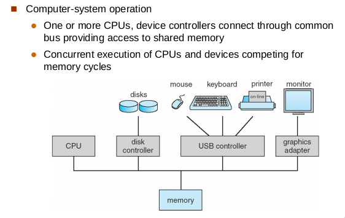

# Introdução

> Linux
>
> - O linux é apenas o **kernel**, em torno do qual orbitam as distribuições.
> - É um sistema velox e possui comunidade ampla e atuante.
> - Segurança satisfatória.

> MINIX
>
> - SO criado pelo Tanenbaum com fins didáticos.
> - O Linux foi desenvolvido com base no MINIX. A primeira compilação do Linux foi em um MINIX do Linus Torvalds.
> - Poucas opções de plataformas: x86 e arm.

> FreeBSD
>
> - Não é apenas um kernel, mas um sistema completo.
> - UNIX.
> - Derivado do Linux.
> - Poucas opções de plataformas: x86, amd64 e arm.

> OpenBSD
>
> - Foco em segurança em corretude.
> - Red Team Field Manual.
> - Provedor de ferramentas importantes para o mundo *nix: OpenSSH, OpenNTPD, OpenSMPD, realyd, spamd, httpd, tmux etc.
> - Suporte a ampla gama de arquiteturas.
> NetBSD
>
> - Amplo suporte a hardware.
> - Propôs gerenciador de pacotes (pckgsrc) que serviu de inspiração aos gerenciadores de pacotes dos outros BSDs e Linux.
> - Uso de linguagens não usuais no kernel (LUA).

## O que é um SO?

Um sistema operacional é um programa que gerencia o hardware de um computador. É um intermediário entre o usuário de um computador e o hardware deste.

Os principais objetivos de um sistema operacional são:

- Executar programas do usuário e facilitar a resolução de problemas do usuário.
- Tornar o uso de um sistema computacional conveniente para o usuário.
- Usar o hardware de um computador de maneira eficiente.

Como um sistema operacional é extenso e complexo, ele deve ser criado parte por parte. Cada uma dessas partes deve ser uma porção bem delimitada do sistema, com entradas, saídas e funções cuidadosamente definidas.

## O que SOs fazem

Um sistema computacional pode ser dividido em quatro componentes:

- Hardware: provê recursos computacionais básicos.
  - CPU, memória, dispositivos I/O.
- Sistema Operacional
  - Controla e coordena o uso do hardware por diversas aplicações e usuários.
- Aplicações: define a forma como recursos computacionais são usados para resolver problemas computacionais do usuário.
  - Editores de texto, compiladores, navegadores de internet, sistemas de banco de dados, jogos.
- Usuários
  - Pessoas, máquinas ou outros computadores.

Podemos explorar os sistemas operacionais de dois pontos de vista:

- Ponto de vista do usuário

Para a maioria dos usuários um sistema operacional é projetado para um único usuário usufruir dos recursos, tal sistema tem o objetivo de facilitar o uso, com algum cuidado em relação à performance e nenhuma ao uso de recursos.

Em outros casos, o usuário utiliza um terminal conectado a um mainframe ou minicomputador, acessado também por outros usuários por meio de outros terminais. Nesse caso, o sistema operacional é projetado para maximizar a utilização de recursos, para garantir que CPU, memória e I/O são utilizados de forma eficiente e equilibrada entre os usuários.

Há também os usuários de workstations conectadas à redes de workstations e servidores. Esses usuários têm recursos próprios, porém partilham recursos de rede e servidores. Nesse caso, o sistema operacional é projetado para encontrar um meio termo entre usabilidade pessoal e uso dos recursos.

- Ponto de vista do sistema

Do ponto de vista do computador, o SO é o programa mais intimamente ligado ao hardware. Podemos ver um sistema operacional como um alocador de recursos, agindo como gerenciador desses recursos e resolvendo os conflitos de acesso a eles.

Um sistema operacional é um programa de controle.

- Controla a execução dos programas para prevenir erros e uso impróprio do computador.

> Definição de Sistema Operacional
>
> A definição mais comum é: o sistema operacional é o programa sendo executado durante todo o funcionado no computador, geralmente chamado de kernel.

Computer Startup

- **Bootstrap program** é carregado na inicialização ou reboot;
  - Geralmente armazenado em ROM ou EPROM e conhecido como **firmware**.
  - Inicia todos os aspectos do sistema.
  - Carrega o kernel do sistema operacional e começa a execução.

## Computer System Organization

## Computer-System Operation

- I/O devices and the CPU can execute concurrently
- Each device controller is in charge of a particular device type and has a local buffer
- CPU moves data from/to main memory to/from local buffers
- I/O goes from the device to the controller's buffer
- Device controller informs CPU that it's finished its operation by causing and **interrupt**

## Common Functions of Interrupts

- The interrupt vector contains the addresses of all the service routines.
- interrupt architecture must save the address of the interrupted instruction
- A trap or exception is a software-generated interrupt caused either by and error or user request
- An operating system is interrupt driven

## Interrupt Handling

- The operating system preserves the state of the CPU by storing registers and the program counter
- Determines which type of interrupt has occurred:
  - polling
  - vectored interrupt system
- Separate segments of code determine what action should be taken for each type of interrupt

## I/O Structure

## [Exercises](../misc/exercises.md#chapter-1)
