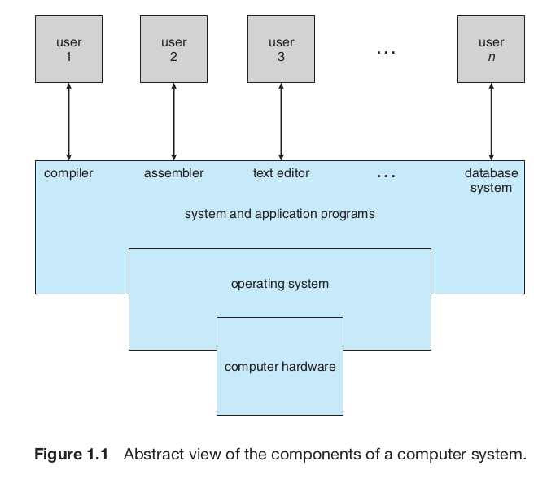

# Introdução

> Linux
>
> - O linux é apenas o **kernel**, em torno do qual orbitam as distribuições.
> - É um sistema velox e possui comunidade ampla e atuante.
> - Segurança satisfatória.

> MINIX
>
> - SO criado pelo Tanenbaum com fins didáticos.
> - O Linux foi desenvolvido com base no MINIX. A primeira compilação do Linux foi em um MINIX do Linus Torvalds.
> - Poucas opções de plataformas: x86 e arm.

> FreeBSD
>
> - Não é apenas um kernel, mas um sistema completo.
> - UNIX.
> - Derivado do Linux.
> - Poucas opções de plataformas: x86, amd64 e arm.

> OpenBSD
>
> - Foco em segurança em corretude.
> - Red Team Field Manual.
> - Provedor de ferramentas importantes para o mundo *nix: OpenSSH, OpenNTPD, OpenSMPD, realyd, spamd, httpd, tmux etc.
> - Suporte a ampla gama de arquiteturas.
> NetBSD
>
> - Amplo suporte a hardware.
> - Propôs gerenciador de pacotes (pckgsrc) que serviu de inspiração aos gerenciadores de pacotes dos outros BSDs e Linux.
> - Uso de linguagens não usuais no kernel (LUA).

## O que é um SO?

Um sistema operacional é um programa que gerencia o hardware de um computador. É um intermediário entre o usuário de um computador e o hardware deste.

Os principais objetivos de um sistema operacional são:

- Executar programas do usuário e facilitar a resolução de problemas do usuário.
- Tornar o uso de um sistema computacional conveniente para o usuário.
- Usar o hardware de um computador de maneira eficiente.

Como um sistema operacional é extenso e complexo, ele deve ser criado parte por parte. Cada uma dessas partes deve ser uma porção bem delimitada do sistema, com entradas, saídas e funções cuidadosamente definidas.

## O que SOs fazem

Um sistema computacional pode ser dividido em quatro componentes:

- Hardware: provê recursos computacionais básicos.
  - CPU, memória, dispositivos I/O.
- Sistema Operacional
  - Controla e coordena o uso do hardware por diversas aplicações e usuários.
- Aplicações: define a forma como recursos computacionais são usados para resolver problemas computacionais do usuário.
  - Editores de texto, compiladores, navegadores de internet, sistemas de banco de dados, jogos.
- Usuários
  - Pessoas, máquinas ou outros computadores.

Podemos explorar os sistemas operacionais de dois pontos de vista:

- Ponto de vista do usuário

Para a maioria dos usuários um sistema operacional é projetado para um único usuário usufruir dos recursos, tal sistema tem o objetivo de facilitar o uso, com algum cuidado em relação à performance e nenhuma ao uso de recursos.

Em outros casos, o usuário utiliza um terminal conectado a um mainframe ou minicomputador, acessado também por outros usuários por meio de outros terminais. Nesse caso, o sistema operacional é projetado para maximizar a utilização de recursos, para garantir que CPU, memória e I/O são utilizados de forma eficiente e equilibrada entre os usuários.

Há também os usuários de workstations conectadas à redes de workstations e servidores. Esses usuários têm recursos próprios, porém partilham recursos de rede e servidores. Nesse caso, o sistema operacional é projetado para encontrar um meio termo entre usabilidade pessoal e uso dos recursos.

- Ponto de vista do sistema

Do ponto de vista do computador, o SO é o programa mais intimamente ligado ao hardware. Podemos ver um sistema operacional como um alocador de recursos, agindo como gerenciador desses recursos e resolvendo os conflitos de acesso a eles.

Um sistema operacional também pode ser visto como um programa de controle, isto é, um programa que controla a execução dos programas para prevenir erros e uso impróprio do computador. Ele preocupa-se, especialmente, com a operação e controle dos dispositivos I/O.

> Definição de Sistema Operacional
>
> A definição mais comum é: o sistema operacional é o programa sendo executado durante todo o funcionado no computador, geralmente chamado de kernel.

## Sistemas computacionais

### Organização

Um computador moderno de propósito geral consiste de uma ou mais CPUs e uma quantidade de controladores de dispositivos conectados por meio de um barramento comum, que provê acesso à memória compartilhada. A CPU e os dispositivos podem funcionar em paralelo, competindo por ciclos de memória, e para assegurar o acesso ordenado à memória, o controlador da memória sincroniza o acesso à ela.

Para que o computador comece a funcionar, após ser ligado ou reiniciado, é necessário que ele tenha um programa inicial para rodar, chamado de **bootstrap program**, que tende a ser simples. Geralmente tal programa é armazenado no hardware do computador na memória de leitura (ROM) ou na memória programável e apagável elétrica (EEPROM) e é conhecido por **firmware**. Ele inicializa todos os aspectos do sistema, desde os registradores da CPU, até os controladores de dispositivos e conteúdo da memória. O programa de bootstrap deve saber como carregar o sistema operacional e executá-lo, localizando o kernel do sistema operacional e carregando-o na memória.

Após o carregamento do kernel, ele pode começar a fornecer serviços para o sistema e seus usuários. Alguns serviços são fornecidos fora do kernel, por programas de sistema que são carregados na memória em tempo de inicialização e tornam-se processos do sistema, ou daemons do sistema, que rodam durante todo o tempo de execução do kernel.

A ocorrência de um evento geralmente é sinalizada por meio de uma interrupção, tanto do hardware quanto do software. O hardware pode provocar uma interrupção a qualquer instante enviando um sinal para a CPU, geralmente por meio do barramento. O software pode provocar uma interrupção executando uma chamada de sistema (system call ou monitor call).

Quando a CPU é interrompida, ela para imediatamente o que estiver executando e transfere a execução para uma localização fixada, que geralmente contém o endereço de início da rotina a ser executada. A rotina de interrupção é executada e, após sua finalização, a CPU continua a computação que foi interrompida.

Como existe uma quantidade predeterminada de interrupções possíveis, uma tabela de ponteiros para rotinas de interrupção pode ser usada para aumentar a velocidade de execução. Geralmente essa tabela é armazenada em endereços baixos de memória, onde são guardados os endereços para as rotinas de interrupção de diversos dispositivos. Esse array, ou **vetor de interrupções**, é indexado por um número único por dispositivo, fornecendo o endereço da rotina a ser executada.

O endereço de retorno após a interrupção também deve ser armazenado, geralmente na pilha do sistema, e é recuperado para o contador de programa após a interrupção.

### Computer-System Operation

- I/O devices and the CPU can execute concurrently
- Each device controller is in charge of a particular device type and has a local buffer
- CPU moves data from/to main memory to/from local buffers
- I/O goes from the device to the controller's buffer
- Device controller informs CPU that it's finished its operation by causing and **interrupt**

### Common Functions of Interrupts

- The interrupt vector contains the addresses of all the service routines.
- interrupt architecture must save the address of the interrupted instruction
- A trap or exception is a software-generated interrupt caused either by and error or user request
- An operating system is interrupt driven

## Interrupt Handling

- The operating system preserves the state of the CPU by storing registers and the program counter
- Determines which type of interrupt has occurred:
  - polling
  - vectored interrupt system
- Separate segments of code determine what action should be taken for each type of interrupt

## I/O Structure

### [Exercises](../misc/exercises.md#chapter-1)

### Referência Bibliográfica

- SILBERSCHATZ A., GALVIN P., GAGNE G. Operating System Concepts, 9th Edition.
