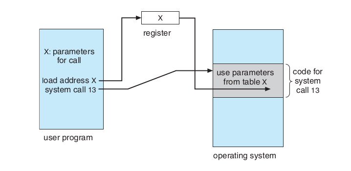
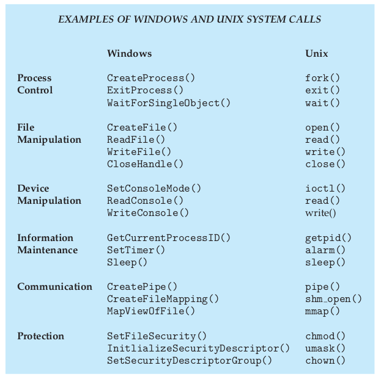
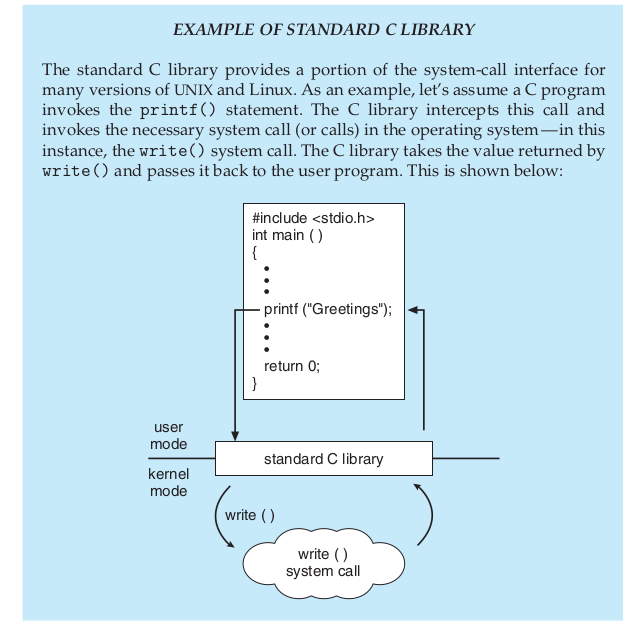
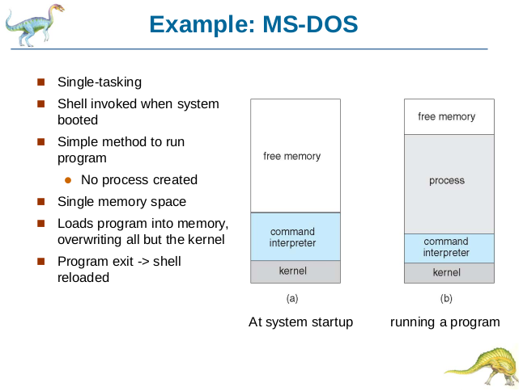
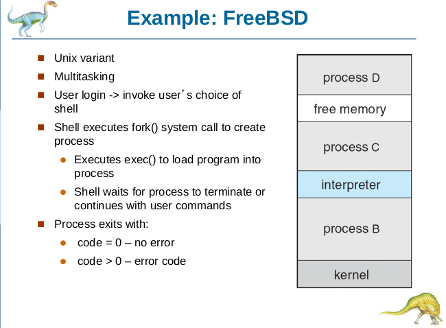

# Operating Systems

## Operating system services

- OS provide an environment for execution of programs and services to programs and users.
- The specif services vary among different OS, but we can identify common classes, as figure 1 shows.

<center>

</center>

<div style="text-align: center">
Figure 1: Services provided by OS. Source: [1]
</div>

Set of operating-system services that are helpful do the user:

- **User interface:** Almost all OS have a user interface (UI)
  - Varies between CLI, GUI and Batch
- **Program execution:**The system must be able to load a program into memory and to run that program, and execute it, either normally or abnormally (indicating error)
- I/O operations: Users usually cannot control I/O devices directly, therefore, the OS must provide a means to do I/O.
- **File-system manipulation:** Programs need to read and write files and directories, some OS also include permissions management to allow or deny access to files or directories based on file ownership
- **Communications:** Communication may occur between processes that are executing on the same computer or between processes that are execution on different computer systems tied together by a computer network. The communication may be implemented via **shared memory** or **message passing**
- **Error detection:** the OS needs to be detecting and correcting erros constantly. Erros may occur in the CPU and memory hardware, in I/O devices and the user program

Some OS functions exists not for helping the user, but rather for **ensuring the efficient operation** of the system itself:

- **Resource allocation:** the OS manages many different types of resources, such as CPU cycles, main memory, I/O devices and file storage
- **Accounting:** we want to keep track of which users use how much and what kinds of computer resources
- **Protection and security:** the owners of information stored in a multiuser or networked computer system may want ot control use of that information. When several separate processes execute concurrently, it shouldn't be possible for one process to interfere with the others or the OS itself.
  - **Protection** involves ensuring that all access to system resources is controlled
  - **Security** of the system from outsiders require user authentication, extends to defending external I/O devices from invalid access attempts

## User and Operating-System Interface

### Command Interpreters (CLI)

- Allows direct command entry, fetches a command from user and executes it.
- Some OS include the command interpreter in the kernel, others, like Windows and UNIX, treats the command interpreter as a special program that's running when a job's initiated or when a user first logs on.
- On system with multiple command interpreters to choose from, the interpreters are known as **shells**.
- Its main function is to get and execute user-specified commands, like create, delete, list, etc.

> The commands can be implemented in two general ways:
>
> - The command interpreter itself contains the code to execute the command, which means the number of commands determines the size of the command interpreter;
> - The commands are implemented through system programs, in this case the command interpreter doesn't understand the command, only uses its name to search for a corresponding file to load into memory and execute.

For example, the command above will search for a file called 'rm', load it into memory and execute with the parameter 'file.txt'

```sh
  rm file.txt
```

This second approach enables the user to add custom commands without the need to alter the command interpreter, and it's used by UNIX, among other operating systems.

### Graphical User Interfaces (GUI)

- User friendly desktop metaphor interface
  - Relies its use in mouse, keyboard, monitor and touchscreen;
  - Contains icons, folders, pointers, etc;
  - Invented at Xerox PARC, but became more widespread with the advent of Apple Macintosh computers in the 80s;
- Most systems now include both CLI and GUI interfaces
  - MS Windows is GUI with the CLI "command" shell;
  - Apple Mac OS X is "Aqua" GUI interface with UNIX kernel underneath and shells available;
  - Unix and linux have CLI with optional GUI interfaces (CDE, KDE, GNOME);

## System Calls

- Provides an interface to the services made available by an operating system.
- Typically written in a high-level language (C or C++).
- Mostly accessed by programs via a high-level API rather than direct system call use.
  - The most common APIs are Win32 API for Windows, POSIX API for POSIX-based system (all versions of UNIX, Linux and Mac OS X) and Java API for the JVM.
- A programmer accesses the API via a library of code provided by the operating system.
  - In UNIX and Linux, the library for C programs is **libc**.
- The use of APIs offers some benefits, among which is the potability of programs between Operational Systems.
- For most programming languages, the run-time support system provides a **system call interface** that serves as a the link to system calls made available by the OS, as illustrated by Figure 2 below.

<center>

</center>

<div style="text-align: center">
Figure 2: Handling of the open() system call. Source: [1]
</div>

- Typically, a number is associated with each system call, and the **system-call interface** maintains a table indexed according to these numbers.
- The system call interface invokes the intended system call in OS kernel and return status of the system call and any return values.
- The caller need to know nothing about how the system call is implemented, just need to obey the API and understand what OS will do as a result call. Most details of OS interface is hidden from programmer by API.

There are three general methods used to pass parameters to the OS:

- The simplest way, passing the parameters in **registers**.
- Parameters stored in a **block** or **table** in memory, and address of block passed as a parameter in a register (approach taken by Linux and Solaris), as illustrated by Figure 3.
- Parameters **pushed** onto the **stack** by the program and **popped** off the stack by the OS.

<center>

</center>
<div style="text-align: center">
Figure 3: System call parameter passing. Source: [1]
</div>

## Types of System Calls

System calls can be grouped in six categories, and the types of system calls for each one are represented in the Table 1 below.

| Category | Types of system calls |
| - | - |
| Process control | - end, abort <br/> - load, execute <br/> - create process, terminate process <br/> - get process attributes, set process attributes <br/> - wait for time <br/> - wait event, signal event <br/> - allocate and free memory <br/>  |
| File management | - create file, delete file <br/> - open, close <br/> - read, write, reposition <br/> - get file attributes, set file attributes <br/>  |
| Device management | - request device, release device <br/> - read, write, reposition <br/> - get device attributes, set device attributes <br/> - logically attach or detach devices <br/>  |
| Information maintenance | - get time or date, set time or date <br/> - get system data, set system data <br/> - get process, file, or device attributes <br/> - set process, file, or device attributes <br/>  |
| Communications | - create, delete communication connection <br/> - send, receive messages <br/> - transfer status information <br/> - attach or detach remote devices <br/> |
<div style="text-align: center">
Table 1: Types of system calls per category. Source: [1]
</div>

<center>

</center>
<div style="text-align: center">
Figure 4: Windows and UNIX system calls. Source: [1]
</div>

<center>

</center>
<div style="text-align: center">
Figure 5: Types of system calls per category. Source: [1]
</div>

## Examples

<center>

</center>

<center>

</center>

## System Programs

- System programs provide a convenient environment for program development and execution, they can be divided into:
  - File manipulation
  - Status information sometimes stored in a File modification
  - Programming language support
  - Program loading and execution
  - Communications
  - Background services
  - Application programs

## References

[1] SILBERSCHATZ A., GALVIN P., GAGNE G. Operating System Concepts, 9th Edition.
