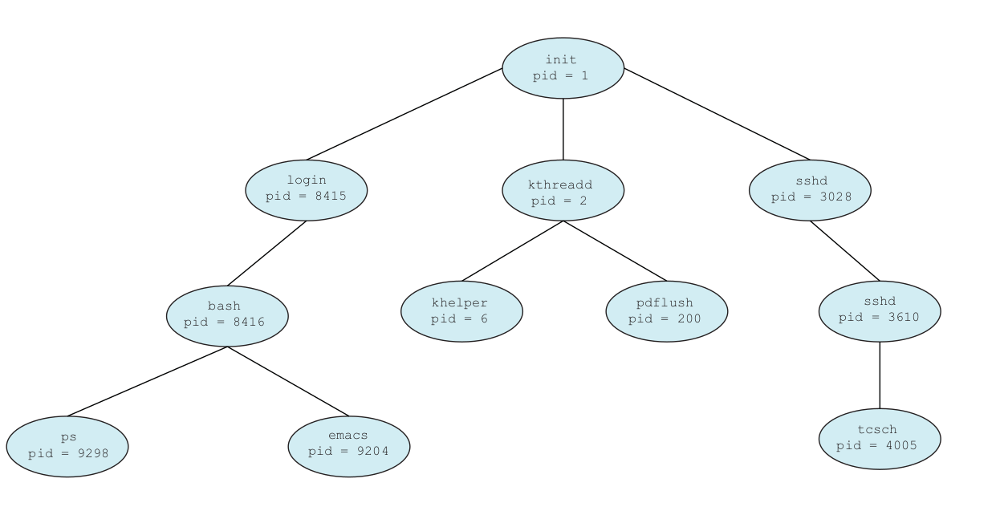
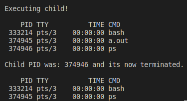
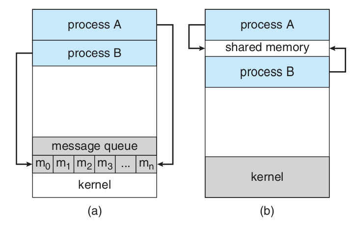

# Processes

Early computers allowed only one program to be executed at a time, and it had complete control of the system and access to all system's resources. Nowadays computer systems allow multiple programs to be loaded into memory and executed simultaneously. These changes resulted in the notion of **process**, which is a program in execution. A system consists of a collection of processes, either operating system processes executing system code and user processes executing user code. All theses processes can execute concurrently with the CPU (or CPUs) **multiplexed** between them, which makes the computer more productive.

## Process Concept

A batch system executes **jobs**, whereas a time-shared system has **user programs** or **tasks**. These activities are called **processes**.

A process is a program in execution, and its more than the program code (**text section**), as it includes the current activity (**program counter**) and the content of the processor's registers. It also includes temporary data (stored in the **stack**), global variables (**data section**) and may include a dynamically allocated memory, the **heap**. This structure is illustrated in Figure 1.

![Figure 1: The process structure in memory. Source: [1]](assets/ch3/2022-12-03-09-38-59.png)

<div style="text-align: center">
<p>Figure 1: The process structure in memory. Source: [1]</p>
</div>

A program is simply a **passive** entity, often called a **executable file**. A process is a **active** entity, with a program counter specifying the next instruction to be executed and a set of resources. A program by itself isn't a process until its running, i. e., a program becomes a process when it's loaded into memory.

During execution, a process changes its **state**, which is defined partly by its current activity. A process state may be one of the represented in Table 1, the state name can change among operating systems.

| State | Description |
| :-: | :- |
| New | The process is being created |
| Running | Its instructions are being executed |
| Waiting | The process's waiting for some event, such as I/O completion |
| Ready | The process's waiting to be assigned to a processor |
| Terminated | The process has finished execution |

<div style="text-align: center">
<p>Table 1: Process states. Source: [1]</p>
</div>

> :material-information-outline: Only **one** process can be running at any processor at any time, but many processes may be ready and waiting. The Figure 2 represents the relationship between the different process states.


<div style="text-align: center">
<p>
Figure 2: Diagram of process state. Source: [1]
</p>
</div>

Each process is represented in the operating system by a **process control block (PCB)**, also called **task control block**, represented in the Figure 3. It contains information about the process state, the next instruction to be executed for this process (program counter), the state of the CPU registers (Figure 4), CPU-scheduling information about priority, scheduling parameters and memory management information, such as base and limit registers and page tables, accounting information and I/O status information.


<div style="text-align: center">
<p>
Figure 3: The PCB structure. Source: [1]
</p>
</div>


<div style="text-align: center">
<p>
Figure 4: CPU switch between processes. Source: [1]
</p>
</div>

> :material-information-outline: Most modern operating system allow a process to have multiple **threads** of execution and execute more than one task at a time. In a multicore system, multiple threads can run in parallel.

## Process Scheduling

The objective of multiprogramming is having some process running at all times, to maximize CPU utilization. The objective of time sharing it to switch the CPU among processes so frequently that users can interact with each program while it's running. The **process scheduler** selects an available process to execute on the CPU, in a single processor system, there'll be only one process running at a time.

When a process enter the system, it joins the **job queue**, those which are ready and waiting to execute are kept in a list called **ready queue**, which is usually a linked list containing the PCB of each process and a pointer to the next process in line. The **device queue** order processes waiting for a particular I/O, and each device has its own device queue (Figure 5).


<div style="text-align: center">
<p>
Figure 5: Diagram of queueing of processes. Source: [1]
</p>
</div>

A process migrate between scheduling queues during its lifetime, and the operating system select process from these queues through the appropriate **scheduler**. Often, in a batch system, more processes are submitted that can be executed immediately, so these processes are spooled to a mass-storage decide and kept for later execution. The **long-term scheduler** (or **job scheduler**) selects processes from this pool and loads them into memory. The **short-term scheduler** (or **CPU scheduler**) select among the processes that are ready and allocate the CPU to one of them. The long-term scheduler controls the **degree of multiprogramming**, which is the number of processes in memory.

In general, most processes are either **I/O bound** or **CPU bound**, the first kind spends more time doing I/O than it spends computing, and for the later the opposite is true. A better performance lays in the long-term scheduler balancing its choices between I/O bound and CPU bound processes.

Some operating systems have an intermediate level of scheduling, the **medium-term scheduler** (Figure 6), that removes processes from memory and reinserts them after a while (**swapping**). Swapping may be necessary according to lack of resources.


<div style="text-align: center">
<p>
Figure 6: Addition of medium-term scheduler in the queueing diagram. Source: [1]
</p>
</div>

When an interrupt occurs, the system needs to save the **context** of the process running on the CPU so it can be resumed later, and the information is stored in the PCB of the process. The operations of saving and restoring this data are called, respectively, **state save** and **state restore**. A **context switch** is the operation of switching CPU between processes, it requires saving the state of the current process and restoring the state of the next process to execute.

## Operations on Processes

### Process Creation

During its execution, a (parent) process may create several child processes, which can also create child processes, creating a **tree** (Figure 7) of processes. In most operating systems, processes are identified by a unique **process identifier (pid)**, usually an integer number.



<div style="text-align: center">
<p>
Figure 7: a tree of processes on a typical Linux system. Source: [1]
</p>
</div>

- The `init` process (pid = 1) serves as the root parent process for all user processes.
- The `kthreadd` process is responsible for creating additional processes that perform tasks on behalf of the kernel.
- The `sshd` process is responsible for managing clients that connect to the system by using ssh.

On UNIX and Linux systems the processes can be listed using the `ps` command.

```sh
ps -el
```

When a process creates a child, it may have to share resources and data with it. Besides that, there are two possible scenarios of execution:

1. The parent continues to execute concurrently with its children;
2. The parent waits until some or all of its children have terminated;

And two scenarios regarding address-space:

1. The child process is a duplicate of the parent process (it has the same program and data as the parent);
2. The child process has a new program loaded into it;

The system call `fork()` creates a new process, which is a copy of the address space of the original process. Both processes, parent and child, continue executing after the `fork()`.

```c
#include <sys/types.h>
#include <unistd.h>

pid_t fork(void);
```

The return code of `fork()` is zero in the child process, and the PID of the child process in the parent. In case of error, -1 is returned in the parent and no child process is created, which is illustrated by the code snippet 1 and its output (Figure 8). After a fork system call, one of the two processes uses the `exec()` system call to replace the process's memory space with a new program.

> :material-information-outline: The `exec()` system call loads a binary file into memory (destroying the memory image of the program containing the exec system call) and starts its execution. The parent process can then create more children or simply `wait()` to move itself off the ready queue until the child terminates (Figure 9).

```c
#include <sys/types.h>
#include <stdio.h>
#include <unistd.h>

int main()
{

    pid_t pid;

    pid = fork();

    if (pid < 0)
    {
        fprintf(stderr, "Fork Failed");
        return 1;
    }
    else if (pid == 0)
    {
        printf("\tExecuting child!\n");
        execlp("/bin/ps", "-l", NULL); // Executes the /bin/ps file with the arguments: "-l NULL"
        
    }
    else
    {
        wait(NULL); // Waits for the termination of the child process.
        printf("\tChild PID was: %d and its now terminated.\n", pid);
        execlp("/bin/ps", "-l", NULL);
    }

    return 0;
}
```

<div style="text-align: center">
<p>
Code snippet 1: Demonstration of the fork system call. Source: [1]
</p>
</div>



<div style="text-align: center">
<p>
Figure 8: Output of the code snippet. Source: author.
</p>
</div>


<div style="text-align: center">
<p>
Figure 9: Process creation using the fork system call. Source: [1]
</p>
</div>

### Process Termination

A process terminates when it finishes executing its final statement and asks the operating system to delete it by the exit() system call. The process may return a status value to its parent via the wait system call. All the resources of the process are deallocated by the OS. Processes can also terminate via an appropriated system call, which usually can only be invoked by its parent process.

Some systems don't allow child processes to keep running after its parent has been terminated, this phenomenon is called **cascading termination**, and normally initiated by the operating system.

>:material-information-outline: In Linux and UNIX system a process can be terminated by the `exit()` system call, that can be invoked directly or by a `return` statement in `main()`.

A parent can wait for the termination of a child process using the `wait()` system call. This system call can receive a parameter to obtain the exit status of the child and it returns the pid of the terminated child. When a process terminate its entry in the process table must remain there until the parent calls `wait()`, because the process table contains the process's exit status. During the period of time when a process is terminated but its parent hasn't yet called `wait()`, a process is in a **zombie** state.

If a process terminated without invoking wait, it would leave its child processes as **orphans**. Linux and UNIX solve this problem assigning the `init` process as the new parent for orphan processes. The init process periodically invokes wait, collecting the exit status of the orphan processes and releasing them from the process table.

## Interprocess Communication

Processes executing concurrently may be either independent of cooperating processes. **Independent** processes cannot affect or be affected by the other processes executing, any process that doesn't share data with other processes is independent. A process is **cooperating** if it can affect or be affected by other processes, clearly processes that share data area cooperating processes. Cooperation can be useful for **information sharing**, **computation speedup**, **modularity** and **convenience**.

Cooperating processes require an **interprocess communication (IPC)** mechanism, and there are two fundamental models of IPC: **shared memory** and **message passing**. In the first, a region of memory is shared between processes and they can share information by reading and writing in this region. In the later, communication takes place by means of messages exchanged between the cooperating processes. Most systems implement both models, message passing is preferred when smaller amounts of data are shared, but shared memory can be faster than message passing.



<div style="text-align: center">
<p>
Figure 10: Interprocess communication models: message passing (a) and shared memory (b). Source: [1]
</p>
</div>

### Shared-Memory Systems

The shared-memory region usually resides in the address space of the process creating it. The processes that wish to communicate using this segment must attach it to their address space. Usually processes aren't allowed to access each others memory, so this model of communication requires that one or more processes agree to remove this restriction. The data then can be shared by writing and reading in the shared area, and the operating system doesn't control how the communication flows, so it's up to the processes assuring that there's no simultaneously writing to the same location.

### Message-Passing Systems

Message passing allow processes to communicate and synchronize their actions without sharing the same address space. If two processes want to communicate through messages, a **communication link** must exist between them. The link and send/receive operations can be implemented, among other ways, using:

- Direct or indirect communication
- Synchronous or asynchronous communication
- Automatic or explicit buffering

Processes that want to communicate must have a way of referring to each other, by means of direct or indirect communication. Under **direct communication** each process must explicitly name the recipient or sender of the communication. In this case, the send and receive operations are defined as:

```c
send(P, message); // Send a message to process P
receive(Q, message); // Receive a message from process Q
```

A communication link, in this scheme, has the following properties:

- A link is established automatically between every pair of processes, who need to know only each other's identity to communicate.
- A link associates exactly two processes.
- Between each pair of processes exists exactly one link.


## References

[1] SILBERSCHATZ A., GALVIN P., GAGNE G. Operating System Concepts, 9th Edition.
