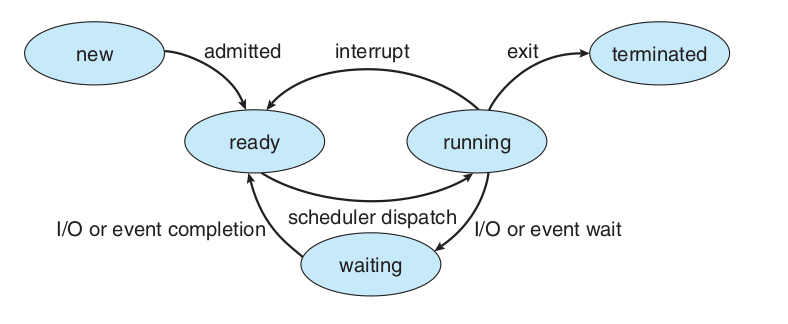
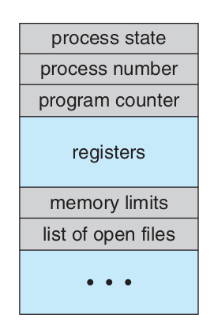
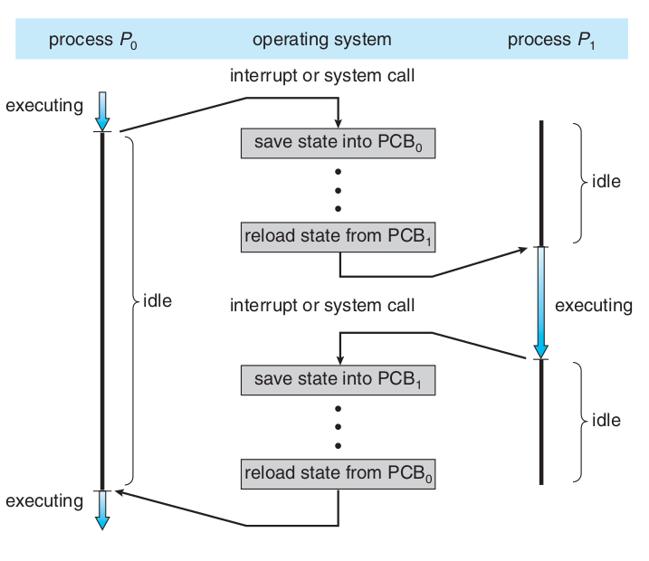
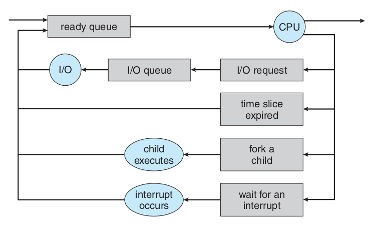
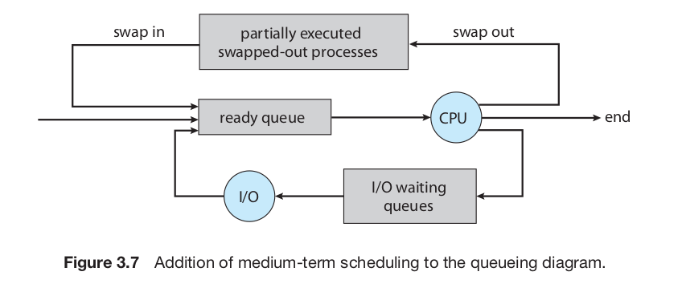

# Chapter 3 - Processes

Early computers allowed only one program to be executed at a time, and it had complete control of the system and access to all system's resources. Nowadays computer systems allow multiple programs to be loaded into memory and executed simultaneously. These changes resulted in the notion of **process**, which is a program in execution. A system consists of a collection of processes, either operating system processes executing system code and user processes executing user code. All theses processes can execute concurrently with the CPU (or CPUs) **multiplexed** between them, which makes the computer more productive.

## Process Concept

A batch system executes **jobs**, whereas a time-shared system has **user programs** or **tasks**. These activities are called **processes**.

A process is a program in execution, and its more than the program code (**text section**), as it includes the current activity (**program counter**) and the content of the processor's registers. It also includes temporary data (stored in the **stack**), global variables (**data section**) and may include a dynamically allocated memory, the **heap**. This structure is illustrated in Figure 1.

![Figure 1: The process structure in memory. Source: [1]](assets/ch3/2022-12-03-09-38-59.png)

Figure 1: The process structure in memory. Source: [1]

A program is simply a **passive** entity, often called a **executable file**. A process is a **active** entity, with a program counter specifying the next instruction to be executed and a set of resources. A program by itself isn't a process until its running, i. e., a program becomes a process when it's loaded into memory.

During execution, a process changes its **state**, which is defined partly by its current activity. A process state may be one of the represented in Table 1, the state name can change among operating systems.

| State | Description |
| :-: | :- |
| New | The process is being created |
| Running | Its instructions are being executed |
| Waiting | The process's waiting for some event, such as I/O completion |
| Ready | The process's waiting to be assigned to a processor |
| Terminated | The process has finished execution |

Table 1: Process states. Source: [1]

> Only **one** process can be running at any processor at any time, but many processes may be ready and waiting. The Figure 2 represents the relationship between the different process states.

Figure 2: Diagram of process state. Source: [1]

Each process is represented in the operating system by a **process control block (PCB)**, also called **task control block**, represented in the Figure 3. It contains information about the process state, the next instruction to be executed for this process (program counter), the state of the CPU registers (Figure 4), CPU-scheduling information about priority, scheduling parameters and memory management information, such as base and limit registers and page tables, accounting information and I/O status information.

Figure 3: The PCB structure. Source: [1]

Figure 4: CPU switch between processes. Source: [1]

> Most modern operating system allow a process to have multiple **threads** of execution and execute more than one task at a time. In a multicore system, multiple threads can run in parallel.

## Process Scheduling

The objective of multiprogramming is having some process running at all times, to maximize CPU utilization. The objective of time sharing it to switch the CPU among processes so frequently that users can interact with each program while it's running. The **process scheduler** selects an available process to execute on the CPU, in a single processor system, there'll be only one process running at a time.

When a process enter the system, it joins the **job queue**, those which are ready and waiting to execute are kept in a list called **ready queue**, which is usually a linked list containing the PCB of each process and a pointer to the next process in line. The **device queue** order processes waiting for a particular I/O, and each device has its own device queue (Figure 5).

Figure 5: Diagram of queueing of processes. Source: [1]

A process migrate between scheduling queues during its lifetime, and the operating system select process from these queues through the appropriate **scheduler**. Often, in a batch system, more processes are submitted that can be executed immediately, so these processes are spooled to a mass-storage decide and kept for later execution. The **long-term scheduler** (or **job scheduler**) selects processes from this pool and loads them into memory. The **short-term scheduler** (or **CPU scheduler**) select among the processes that are ready and allocate the CPU to one of them. The long-term scheduler controls the **degree of multiprogramming**, which is the number of processes in memory.

In general, most processes are either **I/O bound** or **CPU bound**, the first kind spends more time doing I/O than it spends computing, and for the later the opposite is true. A better performance lays in the long-term scheduler balancing its choices between I/O bound and CPU bound processes.

Some operating systems have an intermediate level of scheduling, the **medium-term scheduler** (Figure 6), that removes processes from memory and reinserts them after a while (**swapping**). Swapping may be necessary according to lack of resources.

Figure 6: Addition of medium-term scheduler in the queueing diagram. Source: [1]

When an interrupt occurs, the system needs to save the **context** of the process running on the CPU so it can be resumed later, and the information is stored in the PCB of the process. The operations of saving and restoring this data are called, respectively, **state save** and **state restore**. A **context switch** is the operation of switching CPU between processes, it requires saving the state of the current process and restoring the state of the next process to execute.

## Operations on Processes

## Inter-process Communication

## Communication in Client-Server Systems
