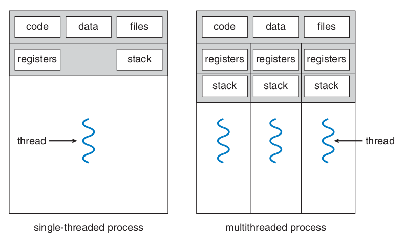
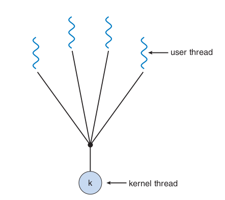
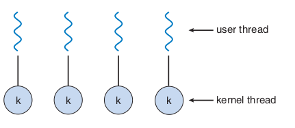
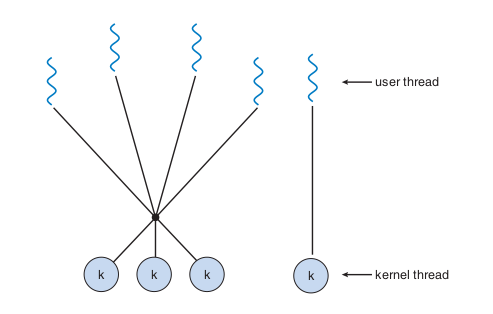

# Threads

## Introduction

A thread is a basic unit of CPU utilization, and it **comprises** a thread ID, a program counter, a register set and a stack. It **shares** with other threads in the same process its code section, data section and operating system resources, such as open files and signals (Figure 1).

A **heavyweight** process is the one that has only one thread of control. A process that has more than one thread can perform more than one task at a time.

<center>

<div style="text-align: center">
<p>
Figure 1: Difference between single threaded and multithreaded processes. Source: [1]
</p>
</div>
</center>

The major benefits of multithreaded programming are:

- Responsiveness: an interactive program can keep running even if a part of it is performing a heavy and lengthy operation.
- Resource sharing: processes can only share resources through shared memory or message passing, but threads share resources and memory of the process to which they belong by default.
- Economy: allocating memory and resources for process creation is costly, so it's more economical to create and context-switch threads.
- Scalability: in a multiprocessor architecture threads may be running in parallel.

## Multicore Programming

During history, single CPU systems evolved to multi CPU systems and, more recently, to multicore systems. Whether the cores appear across CPU chips or within CPU chips, these systems are called **multicore** or **multiprocessors** systems. Multithreading programming provides a mechanism for more efficient use of multicore systems and improved concurrency.

- A system is **parallel** if it can perform more than one task simultaneously;
- A **concurrent** system allows more than one task to run by switching between the tasks very rapidly.

### Programming Challenges

Programming in multicore systems poses five different areas of challenges:

- Identifying tasks: this envolves examining applications to find areas that can be divided into separe, concurrent tasks. Ideally tasks are independent from one another and can run in parallel or individual cores.
- Balance: programmers must ensure that tasks running in parallel contribute equally to the overall process, so that's worth executing them in separe cores.
- Data splitting: the data accessed and manipulated by the tasks must be divided to run on separate cores.
- Data dependency: when one task depends on data from another, they must be synchronized to accommodate the data dependency.
- Testing and debugging: test and debug programs running in parallel on multiple cores is more difficult compared to single-threaded applications debugging.

### Types of parallelism

There are two types of parallelism:

- **Data parallelism**: distributes subsets of the same data across multiple computing cores and all cores perform the same operation.

>:material-lightbulb-outline: Summing the elements of the array `[0...N]` in a dual core system using data parallelism could be implemented by summing `[0...N/2-1]` in one core and `[N/2...N]` on the other.

- **Task parallelism**: involves distributing tasks (threads) across multiple cores, each thread performing a unique operation.

## Multithreading models

Support for threads may be provided at the user level or the kernel level. **User threads** are supported above the kernel and are managed without kernel support, whereas **kernel threads** are supported and managed directly by the operating system.

A relationship between user and kernel threads must exist, and there are three common ways of establishing this relationship: many-to-one model, one-to-one model and many-to-many model.

### Many-to-One Model

In this model (Figure 2), **many user-level threads** are mapped to **one kernel thread**. The thread management is done by the thread library in user space, so it is efficient. However, the entire process will block if a thread makes a blocking system call. Only one thread can access the kernel at a time, so multiple threads are not able to run in parallel on multicore systems.

<center>



<div style="text-align: center">
<p>
Figure 2: Many-to-One model. Source: [1]
</p>
</div>

</center>

### One-to-One Model

In this model (Figure 3), **each user thread** is mapped to **a kernel thread**. It provides more concurrency than the many-to-one model and allows multiple threads to run in parallel on multicore systems. Its only disadvantage is that creating a user thread requires creating the corresponding kernel thread, and the overhead of creating kernel threads can burden the performance of an application. Most implementations of this models restrict the number of threads supported by the system.

> :material-information-outline: Linux and Windows operating systems implement the one-to-one model.

<center>

<div style="text-align: center">
<p>
Figure 3: One-to-One model. Source: [1]
</p>
</div>
</center>

### Many-to-Many Model

This model (Figure 4) multiplexes **many user-level threads** to a smaller or equal number of **kernel threads**, and this number may be specific to either a particular application or a particular machine. It suffers from neither of the previously mentioned shortcoming, developers can create as many user threads as necessary and the corresponding kernel threads can run in parallel on a multiprocessor. When a thread performs a blocking system call, the kernel can schedule another thread for execution.

<center>

<div style="text-align: center">
<p>
Figure 4: Many-to-Many model. Source: [1]
</p>
</div>
</center>

#### Two-level Model

This model (Figure 5) is a variation of the many-to-many model, in which user threads are still multiplexed to a smaller or equal number of kernel threads, but also can be mapped to a single kernel thread.

<center>

<div style="text-align: center">
<p>
Figure 5: Two-level model. Source: [1]
</p>
</div>
</center>

## Thread Libraries

A thread library provides the programmer an API to create and manage threads.

There are two primary ways of implementing a thread library, it can be entirely provided in the user level, with no kernel support, or it can be implemented at the kernel level.

Thread libraries provided at user level implicates in code and data structure for the library existing in user space, so that invoking a function in this library results in a local function call in user space and **not a system call**.

Kernel-level libraries are supported directly by the operational system, so code and data structure for the library exist in kernel space and invoking a function in the library API **usually results in a system call** to the kernel.

The three main libraries in use today are **POSIX Pthreads, Windows and Java**. **Windows library is a kernel-level** available on Windows systems, **Pthreads may be provided at user or kernel level**, and **Java's** thread library API is **generally implemented using a thread library available on the host system** in which the JVM is running.

For POSIX and Windows any **global data**, declared outside of any function, is shared among all threads in the same process. For Java doesn't have the notion of global data, shared access to data must be explicitly arranged between threads. As for **local data**, it's is usually stored in the stack and since each thread has its own stack, each thread has its copy of local data.

Threads can be created by two general strategies: synchronous and asynchronous threading.

- **Synchronous threading**: the parent thread creates one or more children and then **must wait** for all of its children to terminate before resuming its execution (**fork-join** strategy). The threads created execute concurrently, but the parent cannot continue until this work is finished.
- **Asynchronous threading**: once the parent creates a thread it continues its execution, so that **parent and child execute concurrently**.

### Pthreads

It's a POSIX standard defining an API for thread creation and synchronization, it's a **specification**, but **not an implementation**. Operating system designers implement this specification as needed, Linux, MAC OS X and Solaris are some of the UNIX-type systems that implement Pthreads.

```c
#include <pthread.h>
#include <stdio.h>
#include <stdlib.h>

int sum;                   // Data shared by the threads.
void *runner(void *param); // Pointer to the function to be shared by the threads.

int main(int argc, char *argv[])
{
    pthread_t tid;       // Thread identifier.
    pthread_attr_t attr; // Set of thread attributes.

    
    if (argc != 2) 
    {
        fprintf(stderr, "Usage: a.out <integer value>\n");
        return -1;
    }

    if (atoi(argv[1]) < 0)
    {
        fprintf(stderr, "%d must be >=0 \n", atoi(argv[1]));
        return -1;
    }

    pthread_attr_init(&attr); // Initialize thread attributes.
    
    /* Creates thread identified by tid (passed by reference) to run the 
        runner function with param = argv[1] (passed by reference) */
    pthread_create(&tid, &attr, runner, argv[1]);

    /* The calling thread waits for completion of child thread
            The return status is not stored (NULL param); */
    pthread_join(tid, NULL);

    printf("sum = %d\n", sum);

    return 0;
}

// This function is controlled by the thread
void *runner(void *param)
{
    sum = 0;
    int i, upper = atoi(param);
    for (i = 1; i <= upper; i++)
        sum += i;
    pthread_exit(0);
}
```

To declare multiple threads, one can declare a global variable defining the number of threads and repeat the steps above for all the threads.

```c
    #define 
```