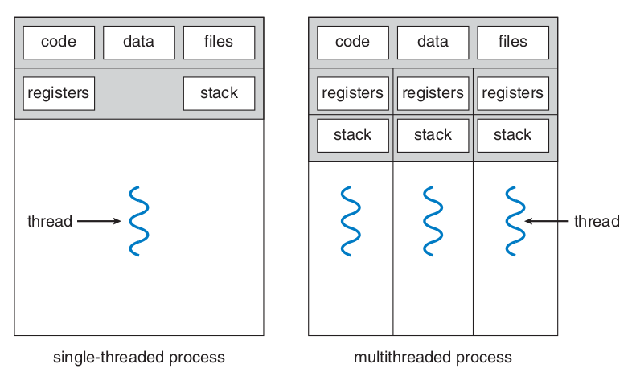
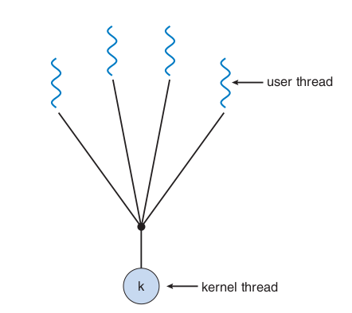
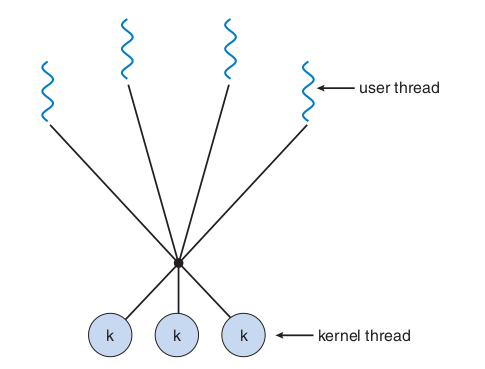
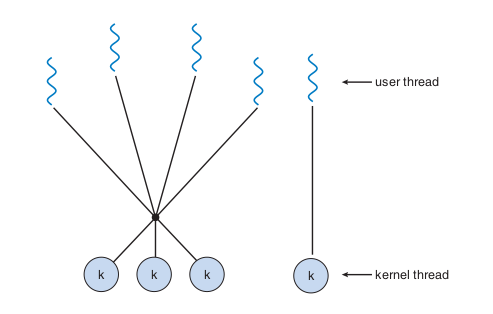
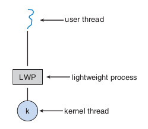

# Threads

## Introduction

A thread is a basic unit of CPU utilization, and it **comprises** a thread ID, a program counter, a register set and a stack. It **shares** with other threads in the same process its code section, data section and operating system resources, such as open files and signals (Figure 1).

A **heavyweight** process is the one that has only one thread of control. A process that has more than one thread can perform more than one task at a time.

<center>

<div style="text-align: center">
<p>
Figure 1: Difference between single threaded and multithreaded processes. Source: [1]
</p>
</div>
</center>

The major benefits of multithreaded programming are:

- Responsiveness: an interactive program can keep running even if a part of it is performing a heavy and lengthy operation.
- Resource sharing: processes can only share resources through shared memory or message passing, but threads share resources and memory of the process to which they belong by default.
- Economy: allocating memory and resources for process creation is costly, so it's more economical to create and context-switch threads.
- Scalability: in a multiprocessor architecture threads may be running in parallel.

## Multicore Programming

During history, single CPU systems evolved to multi CPU systems and, more recently, to multicore systems. Whether the cores appear across CPU chips or within CPU chips, these systems are called **multicore** or **multiprocessors** systems. Multithreading programming provides a mechanism for more efficient use of multicore systems and improved concurrency.

- A system is **parallel** if it can perform more than one task simultaneously;
- A **concurrent** system allows more than one task to run by switching between the tasks very rapidly.

### Programming Challenges

Programming in multicore systems poses five different areas of challenges:

- Identifying tasks: this envolves examining applications to find areas that can be divided into separe, concurrent tasks. Ideally tasks are independent from one another and can run in parallel or individual cores.
- Balance: programmers must ensure that tasks running in parallel contribute equally to the overall process, so that's worth executing them in separe cores.
- Data splitting: the data accessed and manipulated by the tasks must be divided to run on separate cores.
- Data dependency: when one task depends on data from another, they must be synchronized to accommodate the data dependency.
- Testing and debugging: test and debug programs running in parallel on multiple cores is more difficult compared to single-threaded applications debugging.

### Types of parallelism

There are two types of parallelism:

- **Data parallelism**: distributes subsets of the same data across multiple computing cores and all cores perform the same operation.

>:material-lightbulb-outline: Summing the elements of the array `[0...N]` in a dual core system using data parallelism could be implemented by summing `[0...N/2-1]` in one core and `[N/2...N]` on the other.

- **Task parallelism**: involves distributing tasks (threads) across multiple cores, each thread performing a unique operation.

## Multithreading models

Support for threads may be provided at the user level or the kernel level. **User threads** are supported above the kernel and are managed without kernel support, whereas **kernel threads** are supported and managed directly by the operating system.

A relationship between user and kernel threads must exist, and there are three common ways of establishing this relationship: many-to-one model, one-to-one model and many-to-many model.

### Many-to-One Model

In this model (Figure 2), **many user-level threads** are mapped to **one kernel thread**. The thread management is done by the thread library in user space, so it is efficient. However, the entire process will block if a thread makes a blocking system call. Only one thread can access the kernel at a time, so multiple threads are not able to run in parallel on multicore systems.

<center>



<div style="text-align: center">
<p>
Figure 2: Many-to-One model. Source: [1]
</p>
</div>

</center>

### One-to-One Model

In this model (Figure 3), **each user thread** is mapped to **a kernel thread**. It provides more concurrency than the many-to-one model and allows multiple threads to run in parallel on multicore systems. Its only disadvantage is that creating a user thread requires creating the corresponding kernel thread, and the overhead of creating kernel threads can burden the performance of an application. Most implementations of this models restrict the number of threads supported by the system.

> :material-information-outline: Linux and Windows operating systems implement the one-to-one model.

<center>

<div style="text-align: center">
<p>
Figure 3: One-to-One model. Source: [1]
</p>
</div>
</center>

### Many-to-Many Model

This model (Figure 4) multiplexes **many user-level threads** to a smaller or equal number of **kernel threads**, and this number may be specific to either a particular application or a particular machine. It suffers from neither of the previously mentioned shortcoming, developers can create as many user threads as necessary and the corresponding kernel threads can run in parallel on a multiprocessor. When a thread performs a blocking system call, the kernel can schedule another thread for execution.

<center>

<div style="text-align: center">
<p>
Figure 4: Many-to-Many model. Source: [1]
</p>
</div>
</center>

#### Two-level Model

This model (Figure 5) is a variation of the many-to-many model, in which user threads are still multiplexed to a smaller or equal number of kernel threads, but also can be mapped to a single kernel thread.

<center>

<div style="text-align: center">
<p>
Figure 5: Two-level model. Source: [1]
</p>
</div>
</center>

## Thread Libraries

A thread library provides the programmer an API to create and manage threads.

There are two primary ways of implementing a thread library, it can be entirely provided in the user level, with no kernel support, or it can be implemented at the kernel level.

Thread libraries provided at user level implicates in code and data structure for the library existing in user space, so that invoking a function in this library results in a local function call in user space and **not a system call**.

Kernel-level libraries are supported directly by the operational system, so code and data structure for the library exist in kernel space and invoking a function in the library API **usually results in a system call** to the kernel.

The three main libraries in use today are **POSIX Pthreads, Windows and Java**. **Windows library is a kernel-level** available on Windows systems, **Pthreads may be provided at user or kernel level**, and **Java's** thread library API is **generally implemented using a thread library available on the host system** in which the JVM is running.

For POSIX and Windows any **global data**, declared outside of any function, is shared among all threads in the same process. For Java doesn't have the notion of global data, shared access to data must be explicitly arranged between threads. As for **local data**, it's is usually stored in the stack and since each thread has its own stack, each thread has its copy of local data.

Threads can be created by two general strategies: synchronous and asynchronous threading.

- **Synchronous threading**: the parent thread creates one or more children and then **must wait** for all of its children to terminate before resuming its execution (**fork-join** strategy). The threads created execute concurrently, but the parent cannot continue until this work is finished.
- **Asynchronous threading**: once the parent creates a thread it continues its execution, so that **parent and child execute concurrently**.

### Pthreads

It's a POSIX standard defining an API for thread creation and synchronization, it's a **specification**, but **not an implementation**. Operating system designers implement this specification as needed, Linux, MAC OS X and Solaris are some of the UNIX-type systems that implement Pthreads.

```c
#include <pthread.h>
#include <stdio.h>
#include <stdlib.h>

int sum;                   // Data shared by the threads.
void *runner(void *param); // Pointer to the function to be shared by the threads.

int main(int argc, char *argv[])
{
    pthread_t tid;       // Thread identifier.
    pthread_attr_t attr; // Set of thread attributes.

    
    if (argc != 2) 
    {
        fprintf(stderr, "Usage: a.out <integer value>\n");
        return -1;
    }

    if (atoi(argv[1]) < 0)
    {
        fprintf(stderr, "%d must be >=0 \n", atoi(argv[1]));
        return -1;
    }

    pthread_attr_init(&attr); // Initialize thread attributes.
    
    /* Creates thread identified by tid (passed by reference) to run the 
        runner function with param = argv[1] (passed by reference) */
    pthread_create(&tid, &attr, runner, argv[1]);

    /* The calling thread waits for completion of child thread
            The return status is not stored (NULL param); */
    pthread_join(tid, NULL);

    printf("sum = %d\n", sum);

    return 0;
}

// This function is controlled by the thread
void *runner(void *param)
{
    sum = 0;
    int i, upper = atoi(param);
    for (i = 1; i <= upper; i++)
        sum += i;
    pthread_exit(0);
}
```

To declare multiple threads, one can declare a global variable defining the number of threads and repeat the steps above for all the threads.

```c
    #define NUM_THREADS 10

    pthread_t workers[NUM_THREADS];

    for (int i = 0; i < NUM_THREADS; i++)
        pthread_join(workers[i], NULL);
```

## Implicit Threading

The growth of multicore processing leads to applications containing hundreds or thousands of threads. Designing such applications brings a lot of challenges to programmers, and one way to address these difficulties is to transfer the creation and management of threads to the compilers and run-time libraries. This strategy is called **implicit threading**.

### Thread Pools

The idea behind a **thread pool** is to create a number of threads at process startup and place them into a pool, where they sit and wait for work. Once the thread completes its service, it returns to the pool and awaits more work.

Thread pools offer these benefits:

1. Service a request with an existing thread is faster than waiting to create a thread;
2. A thread pool limites the numbe of threads that exist at any one point;
3. Separating the task to be performed from the mechanics of creating the task allow us to use different strategies for running the task, such as schedule the task to execute after a time delay.

### OpenMP

OpenMP is a set of compiler directives as well as an API for programs written in C, C++ or FORTRAN that provides support for parallel programming in shared-memory environments. OpenMP identifies **parallel regions** as blocks of code that may run in parallel. Developers insert compiler directives in their code, and this directives instruct the OpenMP run-time library to execute the region in parallel.

### Grand Central Dispatch

It's a technology for Apple's Mac OS X and iOS operating systems, it allows programmers to identify sections of code to run in parallel. Like OpenMP, GCD manages most of the details of threading.

```c
^{printf("I'm a block");}
```

> :material-information-outline: Blocks are identified by a caret (^) in front a pair of braces {};

GCD schedules block for run-time execution by placing them in on a **dispatch queue**, that can be either **serial** or **concurrent**. The blocks placed in the queue are remove in FIFO order, but int the serial queue once a block has been removed, it must complete execution before another block is removed. In concurrent queues several blocks may be removed at a time, allowing them to execute in parallel.

## Threading issues

### Semantics of `fork()` and `exec()` system calls

The `fork()` system call is used to create a separate, duplicate process. For multithreaded programs the syntax can differ. Some UNIX systems have two versions of fork, one that duplicates all threads and another that duplicates only the thread that invoked the fork.

If a thread invokes the `exec()` system call, the program specified in the parameter of `exec()` will replace the entire process, including all threads.

### Signal handling

Signals are used to notify a process that a particular event has occurred, and it can be received either synchronously or asynchronously, nonetheless signals follow the same pattern:

1. A signal is generated by the occurrence of a particular event;
2. The signal is delivered to a process;
3. Once delivered, the signal must be handled.

Synchronous signals are delivered to the same process that performed the operation that caused the signal, and asynchronous are generated by events external to a running process.

A signal may be **handled** by one of two possible handlers:

1. A default signal handler: every signal has a default handler that the kernel runs when handling it.
2. A user-defined signal handler: the default handler can be overridden by a user defined handler.

Some signals, such as changing the size of a window, are ignored, but others like illegal memory access are handled by terminating the program.

When a program is multithreaded, which thread must receive signals? There are some options, and the method vary depending on the type of signal generated. One can:

1. Deliver the signal to the thread to which the signal applies;
2. Deliver the signal to every thread in the process;
3. Deliver the signal to certain threads in the process;
4. Assign a specific thread to receive all signals for the process;

Synchronous signals need to be delivered to the thread causing the signal, however the situation with asynchronous signals is not as clear. For example, the signal that terminates a process (<control><C>) should be sent to all threads.

> :material-information-outline: The standard UNIX function for delivering a signal is:
> `kill (pid_t pid, int signal)`

Most multithreaded versions of UNIX allow a thread to specify which signals it will accept and which it'll block. Because signals need to be handled only once, a signal is typically delivered only to the first thread found that is not blocking it.

> :material-information-outline: POSIX Pthreads provides the following function:
> `pthread kill(pthread_t tid, int signal)`
> which delivers a signal to a specified thread (tid).

### Thread cancellation

It envolves terminating a thread before it has completed, the thread that is to be cancelled is often called the **target thread**, and it can be cancelled in two different scenarios:

1. Asynchronous cancellation: One thread immediately terminates the target thread.
2. Deferred cancellation: The target thread periodically checks if it should terminate, so it can properly terminate.

The difficult arises when resources are allocated to a canceled thread or when a thread is cancelled while in the midst of updating data it's sharing with other threads. Cancelling a thread asynchronously may result in some resources not being freed. This doesn't occur with deferred cancellation, as the target thread check a flag to determine if it should be canceled, and then the cancellation occurs safely.

> :material-information-outline: Thread cancellation is initiated with the `pthread_cancel()` in Pthreads.

```c
pthread_t tid;

pthread_create(&tid, 0, worker, NULL);

pthread_cancel(tid);
```

Pthreads supports three cancellation modes, defined by a state and type.

| Mode | State | Type |
| - | - | - |
| Off | Disabled | - |
| Deferred | Enabled | Deferred |
| Asynchronous | Enabled | Asynchronous |
<div style="text-align: center">
<p>
Table 1: Cancellation modes in Pthreads. Source: author.
</p>
</div>

The default mode is deferred, and cancellation occurs only when a thread reaches a **cancellation point**. It can be established by invoking `pthread_testcancel()`. If a cancellation request is pending, the **cleanup handler** function is invoked, it allows the resources allocated to this thread to be released before the thread termination.

```c
while(1){
    /* 
        Do some work for awhile.
    */

    pthread_testcancel();
}
```

> :material-information-outline: On Linux systems, thread cancellation using Pthreads API is handled through signals.

### Thread local storage

Threads share data from the process they belong to, but in some cases each thread might need its own copy of certain data, which is called **thread-local storage (TLS)**.

> :material-information-outline: TLS aren't the same as local variables, as they area visible across function invocations. TLS are similar to `static` data, that are declared in the data segment, and not the stack.

### Scheduler Activations

Communication between the kernel and the thread library may be required by the many-to-many and two-level models discussed [previously](#multithreading-models). Many systems implementing theses models place an intermediate data structure between the user and the kernel threads, known as **lightweight process (LWP)** (Figure 6). To the user-thread library, the LWP appears to be a virtual processor on which the application can **schedule a user thread to run**. Each LWP is attached to a kernel thread, and it is schedule to run on physical processors by the operating system. If a kernel thread blocks, it reflects up to the LWP and the user-level thread and they also block.

<center>

</center>

<div style="text-align: center">
<p>
Figure 6: Lightweight process. Source: [1]
</p>
</div>

An application may require any number of LWPs to run. Typically, a LWP is required for each concurrent blocking system call, for example, if five concurrent file-read requests occur simultaneously, five LWPs are needed.

The communication between kernel and user-thread library can be done by a **scheduler activation**. In this scheme, the kernel provides an application with a set of virtual processors (LWPs), and the application can schedule user threads onto an available virtual processor. The kernel must inform an application about certain events, in a procedure known as **upcall**. They are handled by the thread library, with an **upcall handler**, which runs in a virtual processor. When an application thread is about to block, the kernel makes an upcall to the application informing it and identifying the blocking thread. The kernel allocates a new virtual processor to the application, which runs an upcall handler on this new processor, saving the state of the blocking thread and relinquishes the virtual processor where the blocking thread is running. The upcall handler schedules another thread to run on the new virtual processor. When the event the blocking thread was waiting for happens, the kernel makes another upcall to the thread library informing that the blocking thread is now eligible to run. Since the upcall handler for this second event also needs a virtual processor, the kernel makes this allocation to a new virtual processor or one of those being used by the user threads.

## References

[1] SILBERSCHATZ A., GALVIN P., GAGNE G. Operating System Concepts, 9th Edition.

