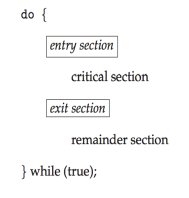

# Process Synchronization

## Background

It's known that processes can execute concurrently, be interrupted at any time and partially complete execution. Because of this, concurrent access to shared data may lead to data inconsistency. A situation where several processes access and manipulate the same data concurrently and the outcome of the execution dependes on the particular order of access is called **race condition**. To avoid this problem, the operating system must provide mechanisms to ensure the **orderly** execution of cooperating processes.

## The Critical Section Problem

When sequential processes are sharing data, mutual exclusion must be provided so that a critical section of code is used by only one process or thread at a time. Each process must ask permission to enter critical section in **entry section**, may follow critical section with **exit section** then **remainder section**.

<center>


</center>
<div style="text-align: center">
<p>
Figure 1: Structure of critical section. Source: [1]
</p>
</div>

A good solution for this problem must ensure:

1. Mutual Exclusion: if process $P_i$ is executing its critical section, then no other process can execute its critical section.
2. Progress: if no process is executing its critical section and there exists processes waiting to enter their critical section, then the selection of the processes that will enter the critical section next can't be postponed indefinitely.
3. Bounded waiting: a bound must exist on the number of times that other processes enter their critical sections after a process has made a request to enter its critical section and before that request is granted.

> :material-information-outline: We assume that each process executes at a nonzero speed, but no assumption is made about the **relative speed** of the processes.

Two general approaches are used to handle critical sections in operating systems:

- **Preemptive kernels**. Allows a process to be preempted while it's running in kernel mode.
- **Non-preemptive kernels**. Doesn't allow a process running in kernel mode to be preempted, so a kernel-mode process will run until it exits kernel mode, blocks or voluntarily yields control of the CPU. **Free of race conditions** in kernel mode.

## Peterson's Solution

Two processes share two variables, `turn` and `flag`. The variable `turn` indicates whose turn it is to enter the critical section. The `flag` array is used to indicate if a process is ready to enter the critical section, i. e., `flag[i]=true` indicates that process $P_i$ is ready.

```c
int turn;
bool flag[2];

void process_0(){
    do {
        flag[0] = true;
        turn = j;
        while (flag[j] && turn == j){
            // Critical section
        }
        flag[i] = false;
            // remainder section
    } while (true);
}
```

This solution meets all the CS requirements.

1. Mutual exclusion is preserved, because $P_i$ enters CS only if either `flag[j] = false` or `turn = i`.
2. Progress requirement is satisfied.
3. Bounded-waiting requirement is met.

## Synchronization Hardware

Many systems provide hardware support for implement the critical section code. The solutions below are base on the idea of **locking**, that is, protecting critical regions via locks.

In a single-processor environment, the critical-section problem could be solved by preventing interrupts from occurring while a shared variable was being modified, in this way we would assure the instructions' order of execution, without preemption. This is often the approach used in nonpreemptive kernels. However, disabling interruptions in a multiprocessor environment can be time consuming and it would decrease system efficiency.

Many modern computer systems provide special hardware instructions to test and modify the content of a word or to swap the contents of two words **atomically**, that is, as one uninterruptible unit.

The `test_and_set()` instruction can be defined as shown below, and it's executed atomically. Thus, if two test and set instructions are executed simultaneously (on different CPUs), they will be executed sequentially in some arbitrary order.

```c
bool test_and_set(bool *target){
    bool rv = *target;
    *target = true;
    return rv;
}
```

If the machine supports the test and set instruction, then one can implement mutual exclusion by declaring a bool variable `lock`, initialized to false. An example of code to the ith process is shown below.

```c
do {
    // While lock == true, do nothing
    while (test_and_set(&lock)){} 
    // Begin of critical section, as soon as lock = false;
    lock = false; // Releases the lock.
    // Remainder section

} while (true);
```

The compare and swap instruction changes a variable value to a new value only if its current value equals a expected value, and always return the original value of the variable. It's also executed atomically.

```c
int compare_and_swap(int *value, int expected, int new_value){
    int temp = *value;
    if (*value == expected){
        *value = new_value;
    }
    return temp;
}
```

Mutual exclusion can be provided by defining a global variable lock, initialized to 0. The first process that invokes `compare_and_swap()` will set lock to 1. Then it enter its critical section, and after finished it releases the lock.

```c
do {
    while (compare_and_swap(&lock, 0, 1) != 0){} // Do nothing until acquires lock.
    // Critical section
    lock = 0; // Releases lock.
    // Remainder section.


} while (true);
```

These algorithms satisfy mutual-exclusion, but they do not satisfy the bounded-waiting requirement, which the algorithm below solves.

```c
// Shared structures
bool *waiting;
bool lock;

void *process_i(void *adress_i)
{
    bool key;
    int j; // next process to acquire the lock
    
    do
    {
        waiting[i] = true;
        key = true;
        while (waiting[i] && key)
            // When key == false, the loop ends.
            key = test_and_set(&lock);
        waiting[i] = false; // Exits the waiting line.

        // Critical section.

        j = (i + 1) % n; // Circular buffer.
        while ((j != 1) && !waiting[j])
            // Circle through processes searching for one that's waiting
            j = (i + j) % n;

        if (j == i)
            lock = false; // Releases its lock
        else
            waiting[j] = false; // Signal for process_j to begin

        // Remainder section;

    } while (true);
}
```

This algorithm satisfies the three conditions:

1. Mutual exclusion, implemented by the locks.
2. Progress, as no process is kept waiting while the lock is free.
3. Bounded-waiting, for one process gives the lock to the following in a circular order.

## Mutex Locks

The hardware-based solutions are generally inaccessible to application programmers. Operating-systems designers build software tools to solve the critical-section problem. The simplest one is the **mutex lock**. It's used to protect critical regions and thus prevent race conditions. A process must acquire the lock before entering a critical section and releases the lock at section's completion.

```c
acquire(){
    while (!available); // Busy wait.
    available = false;
}

release(){
    available = true;
}
```

If the is available, a call to `acquire()` succeeds and the lock gets unavailable. If the lock isn't available, a process that attempts to acquire the lock is blocked until the lock is released. Calls to `acquire()` and `release()` must be performed atomically.

The main disadvantage of this implementation, is that it requires **busy waiting**. This type of mutex is also called **spinlock**, because a process "spins" while waiting for the lock. Spinlocks have the advantage of avoiding context switch, and they're useful when the locks will be held for short periods of time. They're often employed on multiprocessor systems, where one thread can "spin" on one processor while another performs its critical section on another processor.

## Semaphores

A **semaphore** S is an integer variable that, after initialized, is accessed only through two atomic operations: `wait()` and `signal()`.

```c
    wait(S){
        while (S<=0)
        ; // Busy wait
        S--;
    }

    signal(S){
        S++;
    }
```

The operations in wait and signal must be executed indivisibly, i. e., when one process modifies the semaphore value, no other process can simultaneously modify that same semaphore value. In the case of wait(S), the testing and the possible modification must be executed without interruption.

### Semaphore Usage

Operating systems often distinguish between **counting semaphores**, which value ranges over an unrestricted domain, and **binary semaphores**, ranging between 0 and 1, behaving similarly to mutex locks.

Counting semaphores can be used to control access to a given resource with a finite number of instances. In this case, the semaphore is initialized to the number of resources available, and every process that wishes to use the resource performs a wait. If no instance is available, the process will block until another one releases the resource.

Semaphores can also be used to assure order of execution in concurrent processes, as follows:

```c
    // Initialize semaphore to zero.
    int S = 0; 

    process_1(){
        statement_1;
        signal(S);
    }

    process_2(){ 
        // Statement 2 must execute after statement 1.
        wait(S);
        statement_2;
    }

```

### Semaphore Implementation

The busy waiting can be avoided by making a process block itself if `S<=0`. The block operation puts a process into a waiting queue associated with the semaphore, and the state of the process is changed to waiting. Then, the control is transferred to the CPU scheduler, which selects another process to execute.

A process that is blocked, waiting on a semaphore S, should be restarted (through the `wakeup()` operation) when other process executes a `signal()` operation.

```c
typedef struct {
    int value;
    // List of waiting processes.
    struct process *list; 

} semaphore;

wait (semaphore *S){
    S->value--;
    if (S->value <0) {
        add this process to S-> list;
        /* 
        Suspends the process that invokes it.
        Provided by the OS as system call.
        */
        block();
    }
}

signal(semaphore *S){
    S->value++;
    if (S-> value <=0){
        removes a process P from S->list;
        /* 
        Wakes a process that was blocked. 
        Provided by the OS as system call.
        */
        wakeup(P); 
    }
}
```

> :material-information-outline: In this implementations, semaphores may be negative, in this case the magnitude of the semaphore is the number of processes waiting on it.

The list of waiting processes can be implemented as a list of PCBs (process control block), each semaphore contains an integer value and a pointer to this list. To ensure bounded waiting, the list can be implemented as a FIFO queue.

## Deadlocks

A deadlock state occurs when two or more processes are waiting indefinitely for an event that can be caused only by one of the waiting processes. They can be dealt with by three principal methods:

1. Use some protocol to prevent deadlocks, ensuring that the system will never enter a deadlocked state.
2. Allow the system to enter a deadlocked state, detect it and recover.
3. Ignore the problem altogether and pretend that deadlocks never occur in the system (used by most of the OSs).

A deadlock can occur only if four conditions hold simultaneously in the system: mutual exclusion, hold and wait, no preemption and circular wait.

## Starvation

Also called **indefinite blocking**, starvation happens when a process waits indefinitely for a resource. It may occur in semaphores if the processes are removed from the wait list in a LIFO (last-in, first-out) order.

## Priority Inversion

Priority inversion happens when a low priority process interferes in how long a high priority process may wait to execute, and it can only occur in system with more than two priorities.

> :material-information-outline: Example: Assume we have three processes A, B and C, with priority C < B < A. Assume that process A requires a resource R, which is being accessed by process C, so A must wait for C releasing the resource. In the meantime, B may become runnable and preempt process A, causing an inversion of priority.

This problem can be solved by having only two priorities in the system. However, this is insufficient for most operating systems, so they can solve this problem implementing a **priority-inheritance protocol**. All processes that are accessing resources needed by a higher-priority process inherit the higher priority until they are finished with the resources in question. When they're finished, their priorities reverts to the original values.

> :material-information-outline: In the example above, the protocol would allow process C to temporarily inherit the priority of process A, preventing process B to preempting its execution. When C had finished using the resource R, it would come back to its original priority and A would execute, because resource R is now available.

## Classic Problems of Synchronization

Various synchronization problems, such as the bounded-buffer, readers-writers and dining-philosophers problems, are important mainly because they're examples of larger classes of concurrency-control problems. They are used to test nearly every newly proposed synchronization scheme.

### The Bounded-Buffer Problem

In this problem, producer and consumer processes share the following data structures:

```c
    int n;
    semaphore mutex = 1;
    semaphore empty = n;
    semaphore full = 0;

    void producer_process(){
        do {
            // Produce an iten in next_produced.

            wait(empty);
            wait(mutex);

            // Add next_produced to buffer.

            signal(mutex);
            signal(full);

        } while (true);
    }

    void consumer_process(){
        do {
            
            wait(full);
            wait(mutex);

            // Remove and item from buffer to next_consumed.

            signal(mutex);
            signal(empty);

            // Consume the item in next_consumed.

        } while (true);
    }
```

We assume the pool consists of n buffers capable of holding one item. The mutex semaphore manages access to the buffer pool. The empty and full semaphores count the number of empty and full buffers.

In this code, we can say that the producer is producing full buffers for the consumer or that the consumer is producing empty buffers for the producer.

### The Readers-Writers Problem

Processes that want only to read data are called **readers** and the ones that want to read and write are called **writers**. More than one reader can access data simultaneously, but only one writer can access data at a time.

This problem has some variations, the first version requires that no reader be kept waiting unless a writer has already obtained permission to use the shared object.

### The Dining-Philosophers Problem

## Alternative approaches

## References

[1] SILBERSCHATZ A., GALVIN P., GAGNE G. Operating System Concepts, 9th Edition.
