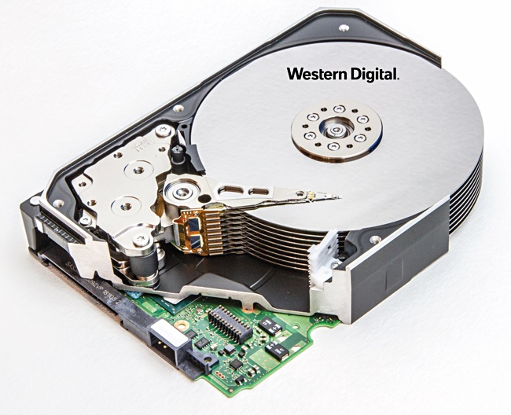
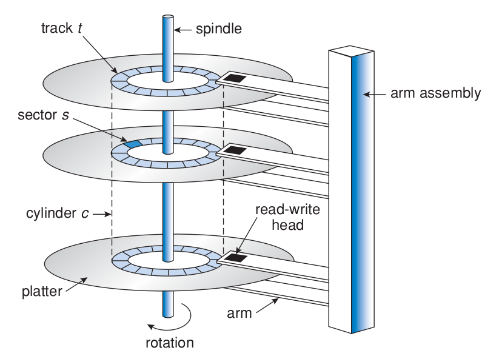

# Chapter 9

## Overview

Disk drives are the major secondary storage I/O devices on most computers. Most secondary storage devices are either magnetic tapes or hard disks, but solid-state disks are becoming more popular.

### Hard disks

Hard disks (Figures 1 and 2) provide the bulk of secondary storage for modern system computers. Each disk **platter** has a flat circular shape, like a CD, with diameter ranging from 4,5 to 8,9 cm. The two surfaces of the platter are covered with a magnetic material, and information is recorded magnetically on the platters.

Figure 1: Hard disk drive. Source: [2]

A read-write head is above each surface of every platter, and are attached to a **disk arm** that moves all the heads as a unit. The surface of a platter is logically divided into circular **tracks**, which are subdivided into **sectors**. The set of tracks that are at one arm position forms a **cylinder**.

Figure 2: Moving-head disk mechanism. Source: [1]

When the disk is in use, a motor spins it at high speed. **Disk speed** has two parts: the **transfer rate** and the **random-access time (positioning time)**. The transfer rage is the rate that data flows between the drive and the computer, and random-access time consists of the time necessary to move the disk arm to the desired cylinder (**seek time**) and the time necessary for the desired sector rotate to the disk head (**rotational latency**).

> :material-information-outline: Common drives usually:
>
> - spin at 5,400, 7,200, 10,000 and 15,000 RPM.
> - can transfer several megabytes of data per second and have seek times and rotational latencies of several milliseconds.

The disk head flies on a very thin space, measured in microns, so there's a danger that the head will make contact with the disk surface. Even though the disk platters are coated with a thin protective layer, the head will sometimes damage the magnetic surface, and this accident is called **head crash**. A head crash normally cannot be repaired, requiring the replacement of the entire disk.

A disk can be **removable**, allowing different disks to be mounted as needed. Removable hard disks usually consist of one platter, held in a plastic case to prevent damage.

> :material-information-outline: CDs, DVDs, Blu-rays discs and removable flash-memory are other forms of removable disks.

A disk drive is attached to a computer by a set of wires called an **I/O bus**. The data transfers on a bus are carried out by special electronic processors called **controllers**, the **host controller** is at the computer end of the bus and the **disk controller** is built into each disk drive. To perform a disk I/O operation, the computer places a command into the host controller, typically using memory-mapped I/O ports. The host controller then sends the command via messages to the disk controller, and it operates the disk-drive hardware to carry out the command. Disk controllers usually have a built-in cache. Data transfer at the disk drive happens between the cache and the disk surface. Data transfer to the host occurs between the cache and the host controller.

> :material-information-outline: Several kind of buses are available, including **advanced technology attachment (ATA), serial ATA (SATA), eSATA, universal serial bus (USB)** and **fibre channel (FC)**.

### Solid-State Disks

Sometimes old technologies are used in new ways as economics change or the technologies evolve. An example is the growing importance of solid-state disks, or SSDs. Simply described, an SSD is nonvolatile memory that is used like a hard drive. There are many variations of this technology, from DRAM with a battery to allow it to maintain its state in a power failure through flash-memory technologies like single-level cell (SLC) and multilevel cell (MLC) chips.

SSDs have the same characteristics as traditional hard disks but can be more reliable because they have no moving parts and faster because they have no seek time or latency. In addition, they consume less power. However, they are more expensive per megabyte than traditional hard disks, have less capacity than the larger hard disks, and may have shorter life spans than hard disks, so their uses are somewhat limited. One use for SSDs is in storage arrays, where they hold file-system metadata that require high performance. SSDs are also used in some laptop computers to make them smaller, faster, and more energy-efficient.

Because SSDs can be much faster than hard disk drives, standard bus interfaces can cause a major limit on throughput. Some SSDs are designed to connect directly to the system bus (PCI, for example). SSDs are changing other traditional aspects of computer design as well. Some systems use them as a direct replacement for disk drives, while others use them as a new cache tier, moving data between hard disks, SSDs, and memory to optimize performance.

### Magnetic Tapes

Magnetic tape was used as an early secondary-storage medium. Although it is relatively permanent and can hold large quantities of data, its access time is slow compared with that of main memory and hard disk. In addition, random access to magnetic tape is about a thousand times slower than random access to hard disk, so tapes are not very useful for secondary storage. Tapes are  used mainly for backup, for storage of infrequently used information, and as a medium for transferring information from one system to another.

A tape is kept in a spool and is wound or rewound past a read –write head. Moving to the correct spot on a tape can take minutes, but once positioned, tape drives can write data at speeds comparable to disk drives. Tape capacities vary greatly, depending on the particular kind of tape drive, with current capacities exceeding several terabytes. Some tapes have built-in compression that can more than double the effective storage. Tapes and their drivers are usually categorized by width, including 4, 8, and 19 millimeters and 1/4 and 1/2 inch. Some are named according to technology, such as LTO-5 and SDLT.

## Disk Structure

Modern disk drives are structured as large one-dimensional arrays of logical disk blocks, usually having 512 bytes of size.

## Disk Attachment

Disks may be attached to a computer system in one of two ways:

- Through the local I/O ports on the host computer
- Through a network connection

## Disk Scheduling

Disk scheduling algorithms aim to maximize performance by scheduling the order of disk I/O.

Requests for disk I/O are generated by the file system and by the virtual memory system. Each request specifies the address on the disk to be referenced, in the form of a logical block number. Disk-scheduling algorithms can improve the effective bandwidth, the average response time and the variance in response time.

Algorithms such as SSTF, SCAN, C-SCAN, LOOK and C-LOOK are designed to make such improvements through strategies for disk-queue ordering.

Performance of disk-scheduling algorithms can vary greatly on hard disks. However, because solid-state disks have no moving parts, performance varies little among algorithms, and quite often a simple FCFS strategy is used.

<!-- @TODO: terminar até a seção Disk Scheduling -->
## Swap-Space Management

## RAID Structure

## Stable-Storage Implementation

## References

[1] SILBERSCHATZ A., GALVIN P., GAGNE G. Operating System Concepts, 9th Edition.
[2] <https://blocksandfiles.com/2019/10/07/10-platter-hard-disk-drives/>
